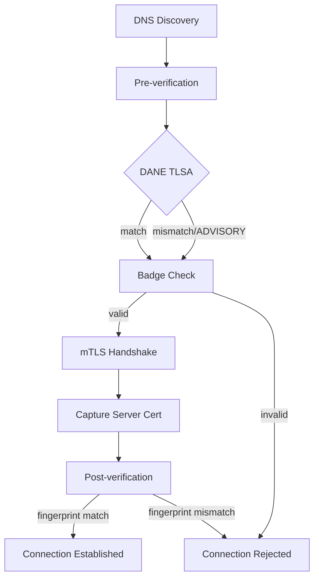

# ATI Java SDK

> Agent Trust Infrastructure (ATI) Java SDK — secure agent-to-agent communication with DNS-based discovery, DANE TLSA verification, and transparency log attestation.

[English](README.md) | [中文](README.zh-CN.md)

## Features

- **DNS-based agent discovery** — resolve agents by ATI Name (`ati://v{version}.{agentHost}`)
- **DANE TLSA verification** — verify server certificates via DNS TLSA records
- **Badge verification** — cryptographically verify agent registration via transparency log
- **mTLS secure connections** — mutual TLS with identity certificate support
- **SCITT transparency headers** — signed transparency headers for auditable agent interactions
- **Spring Boot auto-configuration** — zero-config integration with `ati.sdk.*` properties

## Verification Policies

| Policy | DANE | Badge | Description |
|--------|------|-------|-------------|
| `PKI_ONLY` | DISABLED | DISABLED | Standard TLS only |
| `BADGE_REQUIRED` | DISABLED | REQUIRED | Badge verification required (default) |
| `DANE_AND_BADGE` | REQUIRED | REQUIRED | Both DANE and Badge required |

## Verification Flow



## Modules

| Module | Description |
|--------|-------------|
| [`ati-sdk-core`](ati-sdk-core/README.md) | Configuration, authentication, HTTP, utilities |
| [`ati-sdk-discovery`](ati-sdk-discovery/README.md) | Agent resolution via DNS |
| [`ati-sdk-transparency`](ati-sdk-transparency/README.md) | Transparency log + SCITT verification |
| [`ati-sdk-agent-client`](ati-sdk-agent-client/README.md) | Secure agent-to-agent connections |
| [`ati-sdk-spring-boot-starter`](ati-sdk-spring-boot-starter/README.md) | Spring Boot auto-configuration |

## Installation

### Gradle

```kotlin
// Spring Boot (recommended, includes all modules)
implementation("com.aliyun.ati:ati-sdk-spring-boot-starter:0.1.0")

// Or individual modules
implementation("com.aliyun.ati:ati-sdk-agent-client:0.1.0")     // client-side connection
implementation("com.aliyun.ati:ati-sdk-discovery:0.1.0")         // agent discovery
implementation("com.aliyun.ati:ati-sdk-transparency:0.1.0")      // transparency log
```

### Maven

```xml
<dependency>
  <groupId>com.aliyun.ati</groupId>
  <artifactId>ati-sdk-spring-boot-starter</artifactId>
  <version>0.1.0</version>
</dependency>
```

## Quick Start

### Client Side

`application.yml`:

```yaml
ati:
  sdk:
    mode: client
    discovery:
      endpoint: alidns.aliyuncs.com
      access-key-id: ${ATI_AK}
      access-key-secret: ${ATI_SK}
    identity:
      certificate: /path/to/identity.crt
      private-key: /path/to/identity.key
    transparency:
      base-url: https://ati-tl.cnnic.cn:8180
    verification:
      policy: BADGE_REQUIRED
    client:
      dns-timeout: 5s
      connect-timeout: 10s
```

Java:

```java
AtiVerifiedClient client = AtiVerifiedClient.builder()
    .keyStorePath("/path/to/identity.p12", "password")
    .policy(VerificationPolicy.BADGE_REQUIRED)
    .build();

AtiConnection conn = client.connect("https://agent.example.com",
    ConnectOptions.builder()
        .verificationPolicy(VerificationPolicy.BADGE_REQUIRED)
        .build());
```

### Server Side

`application.yml`:

```yaml
ati:
  sdk:
    mode: server
    server:
      certificate: /path/to/server.crt
      private-key: /path/to/server.key
      port: 443
      verification:
        policy: PKI_ONLY
      idca:
        trust-certificate: /path/to/idca-trust.pem
    transparency:
      base-url: https://ati-tl.cnnic.cn:8180
```

Java:

```java
@SpringBootApplication
public class ServerApplication {
    public static void main(String[] args) {
        SpringApplication.run(ServerApplication.class, args);
    }
}
```

### Spring Boot Auto-Configuration

Set `ati.sdk.mode` to control which side to enable:

| Mode | Client Beans | Server Beans |
|------|-------------|-------------|
| `client` | Yes | No |
| `server` | No | Yes |
| `both` | Yes | Yes |

## Build

```bash
./gradlew clean build
```

Requirements: Java 17+, Gradle 8.5+

## License

[MIT](LICENSE)

## Contributing

See [CONTRIBUTING.md](CONTRIBUTING.md)
