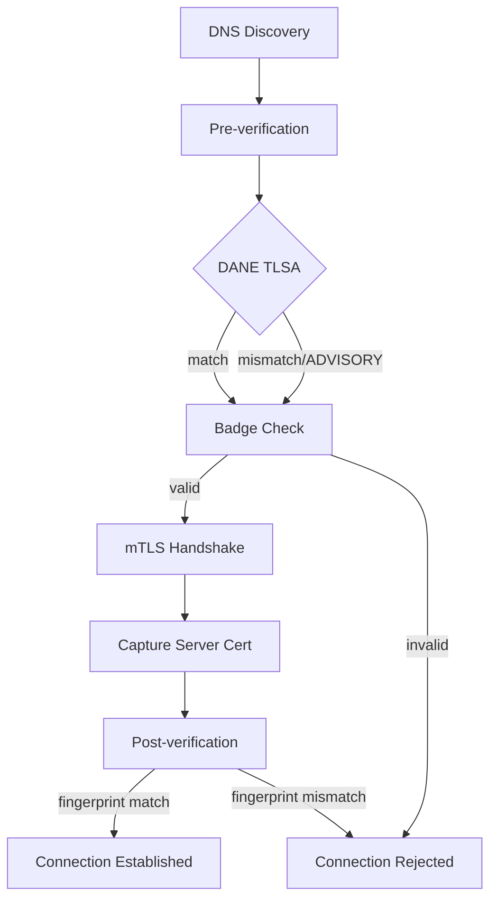

# ATI Java SDK

> Agent Trust Infrastructure (ATI) Java SDK — secure agent-to-agent communication with DNS-based discovery, DANE TLSA verification, and transparency log attestation.

[English](README.md) | [中文](README.zh-CN.md)

## Features

- **DNS-based agent discovery** — resolve agents by ATI Name (`ati://v{version}.{agentHost}`)
- **DANE TLSA verification** — verify server certificates via DNS TLSA records
- **Badge verification** — cryptographically verify agent registration via transparency log
- **mTLS secure connections** — mutual TLS with identity certificate support
- **SCITT transparency headers** — signed transparency headers for auditable agent interactions
- **Spring Boot auto-configuration** — zero-config integration with `ati.sdk.*` properties

## Verification Policies

| Policy | DANE | Badge | Description |
|--------|------|-------|-------------|
| `PKI_ONLY` | DISABLED | DISABLED | Standard TLS only |
| `BADGE_REQUIRED` | DISABLED | REQUIRED | Badge verification required (default) |
| `DANE_AND_BADGE` | REQUIRED | REQUIRED | Both DANE and Badge required |

## Verification Flow



## Verification Sequence Diagrams

### PKI_ONLY: Standard TLS

```
┌────────────┐                              ┌────────────┐                    ┌────────────┐
│Client Agent│                              │Server Agent│                    │ System CA  │
└─────┬──────┘                              └─────┬──────┘                    │Trust Store │
      │                                           │                           └─────┬──────┘
      │  1. TLS Handshake (ClientHello)           │                                 │
      │──────────────────────────────────────────▶│                                 │
      │                                           │                                 │
      │  2. ServerHello + Certificate Chain       │                                 │
      │◀──────────────────────────────────────────│                                 │
      │                                           │                                 │
      │  3. Validate cert chain against CA store  │                                 │
      │─────────────────────────────────────────────────────────────────────────▶│
      │                                           │                                 │
      │  4. Chain valid ✓                         │                                 │
      │◀─────────────────────────────────────────────────────────────────────────│
      │                                           │                                 │
      │  5. Complete TLS Handshake                │                                 │
      │◀─────────────────────────────────────────▶│                                 │
      │                                           │                                 │
      │  6. Encrypted Application Data            │                                 │
      │◀═════════════════════════════════════════▶│                                 │
```

### BADGE_REQUIRED: TLS + Transparency Log Verification

```
┌────────────┐         ┌────────────┐         ┌────────────┐         ┌────────────┐
│Client Agent│         │  ATI Console│         │  CNNIC TL  │         │Server Agent│
│            │         │  (OpenAPI)  │         │            │         │            │
└─────┬──────┘         └──────┬─────┘         └──────┬─────┘         └─────┬──────┘
      │                       │                      │                     │
      │  1. Discover agent    │                      │                     │
      │   (hostname, version) │                      │                     │
      │──────────────────────▶│                      │                     │
      │                       │                      │                     │
      │  2. AgentDescriptor    │                      │                     │
      │   (host, badgeUrl)    │                      │                     │
      │◀──────────────────────│                      │                     │
      │                       │                      │                     │
      │  3. Fetch badge from TL                      │                     │
      │─────────────────────────────────────────────▶│                     │
      │                       │                      │                     │
      │  4. Badge + Seal + Merkle Proof              │                     │
      │◀─────────────────────────────────────────────│                     │
      │                       │                      │                     │
      │  5. Verify badge signature & seal            │                     │
      │     (using TL root key)                      │                     │
      │                       │                      │                     │
      │  6. TLS Handshake     │                      │                     │
      │────────────────────────────────────────────────────────────────────▶│
      │                       │                      │                     │
      │  7. Server Certificate Chain                 │                     │
      │◀────────────────────────────────────────────────────────────────────│
      │                       │                      │                     │
      │  8. Post-verify: compare server cert hash with badge               │
      │     ┌─────────────────────────────────┐                            │
      │     │ cert_hash == badge_hash ? ✓    │                            │
      │     └─────────────────────────────────┘                            │
      │                       │                      │                     │
      │  9. Connection Established                     │                     │
      │◀═══════════════════════════════════════════════════════════════════▶│
```

### DANE_AND_BADGE: Full Verification

```
┌────────────┐     ┌────────────┐     ┌────────────┐     ┌────────────┐     ┌────────────┐
│Client Agent│     │ DNS Server │     │  ATI Console│     │  CNNIC TL  │     │Server Agent│
│            │     │            │     │  (OpenAPI)  │     │            │     │            │
└─────┬──────┘     └─────┬──────┘     └──────┬─────┘     └──────┬─────┘     └─────┬──────┘
      │                   │                   │                  │                  │
      │ 1. Discover agent │                   │                  │                  │
      │──────────────────────────────────────▶│                  │                  │
      │                   │                   │                  │                  │
      │ 2. AgentDescriptor│                   │                  │                  │
      │◀──────────────────────────────────────│                  │                  │
      │                   │                   │                  │                  │
      │ 3. Query TLSA     │                   │                  │                  │
      │  _443._tcp.host   │                   │                  │                  │
      │──────────────────▶│                   │                  │                  │
      │                   │                   │                  │                  │
      │ 4. TLSA: 3 1 1    │                   │                  │                  │
      │   <cert-hash>     │                   │                  │                  │
      │◀──────────────────│                   │                  │                  │
      │                   │                   │                  │                  │
      │ 5. Fetch badge from TL                 │                  │                  │
      │──────────────────────────────────────────────────────────▶│                  │
      │                   │                   │                  │                  │
      │ 6. Badge + Seal + Merkle Proof         │                  │                  │
      │◀──────────────────────────────────────────────────────────│                  │
      │                   │                   │                  │                  │
      │ 7. Verify badge & DANE TLSA            │                  │                  │
      │                   │                   │                  │                  │
      │ 8. TLS Handshake  │                   │                  │                  │
      │───────────────────────────────────────────────────────────────────────────────▶│
      │                   │                   │                  │                  │
      │ 9. Server Cert    │                   │                  │                  │
      │◀───────────────────────────────────────────────────────────────────────────────│
      │                   │                   │                  │                  │
      │10. Post-verify: DANE hash + Badge hash match          │                  │
      │     ┌─────────────────────────────────┐              │                  │
      │     │ DANE ✓  Badge ✓  Cert ✓        │              │                  │
      │     └─────────────────────────────────┘              │                  │
      │                   │                   │                  │                  │
      │11. Connection Established              │                  │                  │
      │◀═══════════════════════════════════════════════════════════════════════════════▶│
```

## Modules

| Module | Description |
|--------|-------------|
| [`ati-sdk-core`](ati-sdk-core/README.md) | Configuration, authentication, HTTP, utilities |
| [`ati-sdk-discovery`](ati-sdk-discovery/README.md) | Agent resolution via DNS |
| [`ati-sdk-transparency`](ati-sdk-transparency/README.md) | Transparency log + SCITT verification |
| [`ati-sdk-agent-client`](ati-sdk-agent-client/README.md) | Secure agent-to-agent connections |
| [`ati-sdk-spring-boot-starter`](ati-sdk-spring-boot-starter/README.md) | Spring Boot auto-configuration |

## Installation

### Gradle

```kotlin
// Spring Boot (recommended, includes all modules)
implementation("com.aliyun.ati:ati-sdk-spring-boot-starter:0.1.0")

// Or individual modules
implementation("com.aliyun.ati:ati-sdk-agent-client:0.1.0")     // client-side connection
implementation("com.aliyun.ati:ati-sdk-discovery:0.1.0")         // agent discovery
implementation("com.aliyun.ati:ati-sdk-transparency:0.1.0")      // transparency log
```

### Maven

```xml
<dependency>
  <groupId>com.aliyun.ati</groupId>
  <artifactId>ati-sdk-spring-boot-starter</artifactId>
  <version>0.1.0</version>
</dependency>
```

## Quick Start

### Agent Registration

Agent registration is completed in the [Alibaba Cloud ATI Console](https://ati.console.aliyun.com). The registration flow:

```
┌─────────────┐    ┌─────────────┐    ┌─────────────┐    ┌─────────────┐
│  Generate   │───▶│  Submit CSR │───▶│  ACME + DNS  │───▶│   ACTIVE    │
│  Keys & CSR │    │  to Console │    │  Verification│    │ (Discoverable)│
└─────────────┘    └─────────────┘    └─────────────┘    └─────────────┘
```

1. **Generate key pairs** — Create RSA/EC key pairs for identity and server certificates
2. **Generate CSRs** — Create Certificate Signing Requests (server CSR + identity CSR with ATI Name)
3. **Submit registration** — Register agent in ATI Console with agentHost, version, endpoints, and CSRs
4. **ACME verification** — Add DNS TXT record for domain ownership proof
5. **Certificate issuance** — ATI issues identity and server certificates
6. **DNS verification** — Add TLSA and badge DNS records
7. **Active** — Agent is discoverable via ATI Name

> **Note:** All steps are performed in the ATI Console. No SDK code is needed for registration.

### Agent Discovery

Resolve agent information via Alibaba Cloud OpenAPI:

```java
import com.aliyun.ati.sdk.discovery.DnsAtiDiscoveryClient;
import com.aliyun.ati.sdk.auth.AccessKeyCredentialsProvider;
import com.aliyun.ati.sdk.discovery.AtiAgentDescriptor;

// Create discovery client with AK/SK
DnsAtiDiscoveryClient client = DnsAtiDiscoveryClient.builder()
    .endpoint("alidns.aliyuncs.com")
    .credentialsProvider(new AccessKeyCredentialsProvider(ak, sk))
    .build();

// Resolve by hostname with version constraint
AtiAgentDescriptor agent = client.discover("agent.example.com", "1.0.0");
System.out.println("Agent host: " + agent.getAgentHost());
System.out.println("Badge URL: " + agent.getBadgeUrl());

// Resolve latest version
AtiAgentDescriptor latest = client.discover("agent.example.com");

// Async resolution
CompletableFuture<AtiAgentDescriptor> future = client.discoverAsync("agent.example.com");
```

### Agent-to-Agent Connections

Connect to another agent with configurable verification levels:

```java
import com.aliyun.ati.sdk.agent.AtiVerifiedClient;
import com.aliyun.ati.sdk.agent.ConnectOptions;
import com.aliyun.ati.sdk.agent.VerificationPolicy;
import com.aliyun.ati.sdk.agent.AtiConnection;

// Create the client
AtiVerifiedClient client = AtiVerifiedClient.builder()
    .keyStorePath("/path/to/identity.p12", "password")
    .policy(VerificationPolicy.BADGE_REQUIRED)
    .build();

// PKI only — standard HTTPS with CA validation
AtiConnection conn = client.connect("https://agent.example.com",
    ConnectOptions.builder()
        .verificationPolicy(VerificationPolicy.PKI_ONLY)
        .build());

// Badge verification (recommended) — verifies against transparency log
AtiConnection conn = client.connect("https://agent.example.com",
    ConnectOptions.builder()
        .verificationPolicy(VerificationPolicy.BADGE_REQUIRED)
        .build());

// Full verification — DANE + Badge
AtiConnection conn = client.connect("https://agent.example.com",
    ConnectOptions.builder()
        .verificationPolicy(VerificationPolicy.DANE_AND_BADGE)
        .build());

// With mTLS client certificate + Bearer token
AtiConnection conn = client.connect("https://agent.example.com",
    ConnectOptions.builder()
        .verificationPolicy(VerificationPolicy.DANE_AND_BADGE)
        .clientCertPath(Path.of("/path/to/client.crt"), Path.of("/path/to/client.key"))
        .authProvider(HttpAuthHeadersProvider.bearer("token"))
        .build());
```

### Spring Boot Auto-Configuration

`application.yml` (client side):

```yaml
ati:
  sdk:
    mode: client
    discovery:
      endpoint: alidns.aliyuncs.com
      access-key-id: ${ATI_AK}
      access-key-secret: ${ATI_SK}
    identity:
      certificate: /path/to/identity.crt
      private-key: /path/to/identity.key
    transparency:
      base-url: https://ati-tl.cnnic.cn:8180
    verification:
      policy: BADGE_REQUIRED
    client:
      dns-timeout: 5s
      connect-timeout: 10s
```

`application.yml` (server side):

```yaml
ati:
  sdk:
    mode: server
    server:
      certificate: /path/to/server.crt
      private-key: /path/to/server.key
      port: 443
      verification:
        policy: PKI_ONLY
      idca:
        trust-certificate: /path/to/idca-trust.pem
    transparency:
      base-url: https://ati-tl.cnnic.cn:8180
```

Set `ati.sdk.mode` to control which side to enable:

| Mode | Client Beans | Server Beans |
|------|-------------|-------------|
| `client` | Yes | No |
| `server` | No | Yes |
| `both` | Yes | Yes |

## Build

```bash
./gradlew clean build
```

Requirements: Java 17+, Gradle 8.5+

## License

[MIT](LICENSE)

## Contributing

See [CONTRIBUTING.md](CONTRIBUTING.md)
