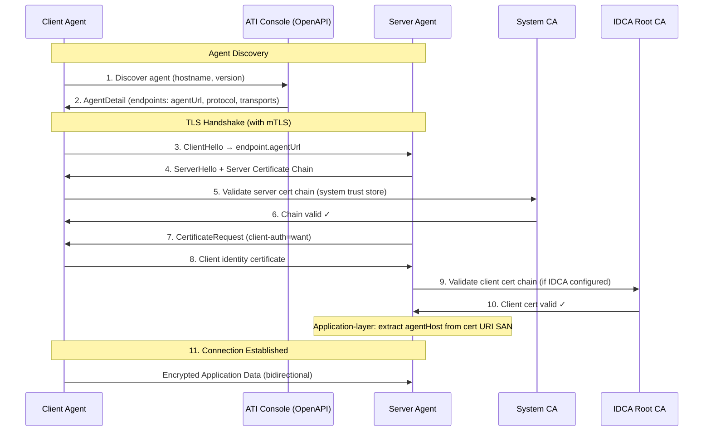
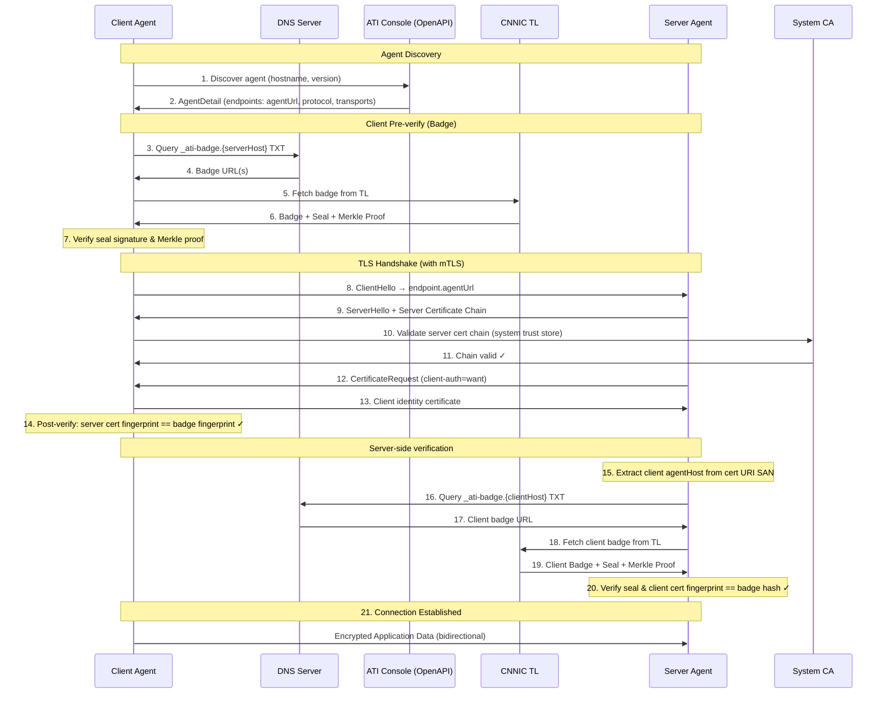
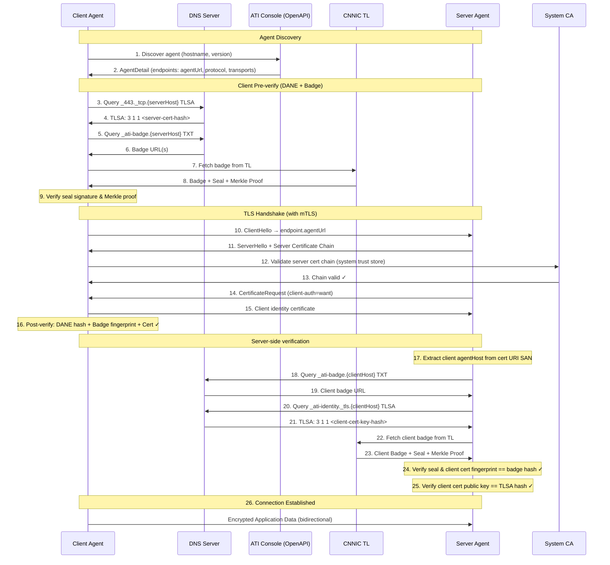

# ATI Java SDK

> Agent Trust Infrastructure (ATI) Java SDK — secure agent-to-agent communication with registry-based discovery, DANE TLSA verification, and transparency log attestation.

[English](README.md) | [中文](README.zh-CN.md)

## Features

- **Registry-based agent discovery** — resolve agents via RA OpenAPI by `agentHost` and optional version constraint
- **DANE TLSA verification** — verify server certificates via DNS TLSA records
- **Badge verification** — cryptographically verify agent registration via the CNNIC Transparency Log
- **mTLS secure connections** — mutual TLS with identity certificate support
- **SCITT transparency headers (planned)** — auditable HTTP attestation via Receipt and Status Token; low-level infrastructure exists in `ati-sdk-transparency`, not yet wired into Connection verification
- **Spring Boot auto-configuration** — zero-config integration with `ati.sdk.*` properties

## Verification Policies

| Policy | TLS | DANE | Badge | Description |
|--------|-----|------|-------|-------------|
| `PKI_ONLY` | ✓ | - | - | Standard TLS only |
| `BADGE_REQUIRED` | ✓ | - | ✓ | TLS + Badge verification (default) |
| `DANE_AND_BADGE` | ✓ | ✓ | ✓ | TLS + DANE + Badge |

## Verification Sequence Diagrams

### PKI_ONLY: Agent Discovery + Standard TLS (+ IDCA on server side)



### BADGE_REQUIRED: TLS + Transparency Log Verification



### DANE_AND_BADGE: Full Verification



## Modules

| Module | Description |
|--------|-------------|
| [`ati-sdk-core`](ati-sdk-core/README.md) | Configuration, authentication, HTTP, utilities |
| [`ati-sdk-discovery`](ati-sdk-discovery/README.md) | Agent resolution via RA OpenAPI |
| [`ati-sdk-transparency`](ati-sdk-transparency/README.md) | Transparency log verification (+ SCITT infrastructure, planned) |
| [`ati-sdk-agent-client`](ati-sdk-agent-client/README.md) | Secure agent-to-agent connections |
| [`ati-sdk-spring-boot-starter`](ati-sdk-spring-boot-starter/README.md) | Spring Boot auto-configuration |

## Installation

### Gradle

```kotlin
// Spring Boot (recommended, includes all modules)
implementation("com.aliyun.ati:ati-sdk-spring-boot-starter:0.1.0")

// Or individual modules
implementation("com.aliyun.ati:ati-sdk-agent-client:0.1.0")     // client-side connection
implementation("com.aliyun.ati:ati-sdk-discovery:0.1.0")         // agent discovery
implementation("com.aliyun.ati:ati-sdk-transparency:0.1.0")      // transparency log
```

### Maven

```xml
<dependency>
  <groupId>com.aliyun.ati</groupId>
  <artifactId>ati-sdk-spring-boot-starter</artifactId>
  <version>0.1.0</version>
</dependency>
```

## Quick Start

### Agent Registration

Agent registration is completed in the [Alibaba Cloud ATI Console](https://dnsnext.console.aliyun.com/ati/agents). The registration flow:

```
┌──────────────┐    ┌──────────────┐    ┌──────────────┐    ┌──────────────┐
│   Generate   │───▶│    Submit    │───▶│  ACME + DNS  │───▶│    ACTIVE    │
│ Identity CSR │    │  to Console  │    │ Verification │    │(Discoverable)│
└──────────────┘    └──────────────┘    └──────────────┘    └──────────────┘
```

1. **Generate identity key pair** — Create RSA/EC key pair for identity certificate (offline)
2. **Generate identity CSR** — Create Certificate Signing Request with ATI Name URI SAN
3. **Submit registration** — Input service certificate + identity CSR in ATI Console with agentHost, version, endpoints (service certificate is user-provided)
4. **ACME verification** — Add DNS TXT record for domain ownership proof
5. **Identity certificate issuance** — CNNIC issues the identity certificate via IDCA (service certificate is user-provided, not issued by CNNIC or the RA)
6. **DNS verification** — Add TLSA and badge DNS records
7. **Active** — Agent is discoverable via ATI Name

> **Note:** All steps are performed in the ATI Console. No SDK code is needed for registration.

### Agent Discovery

Resolve agent information via the RA OpenAPI:

```java
import com.aliyun.ati.sdk.discovery.AtiDiscoveryClient;
import com.aliyun.ati.sdk.discovery.AgentDetail;

// Create discovery client with AK/SK
AtiDiscoveryClient client = new AtiDiscoveryClient(
    "alidns.aliyuncs.com", accessKeyId, accessKeySecret);

// Resolve by hostname with version constraint
AgentDetail agent = client.discover("agent.example.com", "1.0.0");
System.out.println("Agent host: " + agent.getAgentHost());
System.out.println("Endpoints: " + agent.getEndpoints());

// Resolve latest version
AgentDetail latest = client.discover("agent.example.com");
```

### Agent-to-Agent Connections

Connect to another agent with configurable verification levels:

```java
import com.aliyun.ati.sdk.agent.AtiVerifiedClient;
import com.aliyun.ati.sdk.agent.ConnectOptions;
import com.aliyun.ati.sdk.agent.VerificationPolicy;
import com.aliyun.ati.sdk.agent.AtiConnection;

// Create the client
AtiVerifiedClient client = AtiVerifiedClient.builder()
    .keyStorePath("/path/to/identity.p12", "password")
    .policy(VerificationPolicy.BADGE_REQUIRED)
    .build();

// PKI only — standard HTTPS with CA validation
AtiConnection conn = client.connect("https://agent.example.com",
    ConnectOptions.builder()
        .verificationPolicy(VerificationPolicy.PKI_ONLY)
        .build());

// Badge verification (recommended) — verifies against transparency log
AtiConnection conn = client.connect("https://agent.example.com",
    ConnectOptions.builder()
        .verificationPolicy(VerificationPolicy.BADGE_REQUIRED)
        .build());

// Full verification — DANE + Badge
AtiConnection conn = client.connect("https://agent.example.com",
    ConnectOptions.builder()
        .verificationPolicy(VerificationPolicy.DANE_AND_BADGE)
        .build());

// With mTLS client certificate + Bearer token
AtiConnection conn = client.connect("https://agent.example.com",
    ConnectOptions.builder()
        .verificationPolicy(VerificationPolicy.DANE_AND_BADGE)
        .clientCertPath(Path.of("/path/to/client.crt"), Path.of("/path/to/client.key"))
        .authProvider(HttpAuthHeadersProvider.bearer("token"))
        .build());
```

### Spring Boot Auto-Configuration

`application.yml` (client side):

```yaml
ati:
  sdk:
    mode: client
    discovery:
      endpoint: alidns.aliyuncs.com
      access-key-id: ${ATI_AK}
      access-key-secret: ${ATI_SK}
    identity:
      certificate: /path/to/identity.crt
      private-key: /path/to/identity.key
    transparency:
      base-url: https://ati-tl.cnnic.cn:8180
    verification:
      policy: BADGE_REQUIRED
    client:
      dns-timeout: 5s
      connect-timeout: 10s
```

`application.yml` (server side):

```yaml
ati:
  sdk:
    mode: server
    server:
      certificate: /path/to/server.crt
      private-key: /path/to/server.key
      port: 443
      verification:
        policy: PKI_ONLY
      idca:
        trust-certificate: /path/to/idca-trust.pem
    transparency:
      base-url: https://ati-tl.cnnic.cn:8180
```

Set `ati.sdk.mode` to control which side to enable:

| Mode | Client Beans | Server Beans |
|------|-------------|-------------|
| `client` | Yes | No |
| `server` | No | Yes |
| `both` | Yes | Yes |

## Configuration

### Transparency Log

The Transparency Log (TL) stores agent Badges and is **operated by CNNIC only** — there is no separate Alibaba Cloud TL service. RA (Alibaba Cloud ATI) handles registration; CNNIC TL holds the append-only Badge records used for verification.

`TransparencyClient` connects to CNNIC TL to verify agent badges and seals:

```java
// Production default — CNNIC TL
TransparencyClient tl = TransparencyClient.builder()
    .baseUrl(TransparencyClient.CNNIC_BASE_URL)   // https://ati-tl.cnnic.cn:8180
    .build();

// Custom timeouts and root key cache TTL
TransparencyClient tl = TransparencyClient.builder()
    .baseUrl(TransparencyClient.CNNIC_BASE_URL)
    .connectTimeout(Duration.ofSeconds(5))
    .readTimeout(Duration.ofSeconds(15))
    .rootKeyCacheTtl(Duration.ofHours(12))   // default: 24 hours
    .build();
```

### Verification Policy

Configure the verification level via `ConnectOptions`:

```java
// PKI_ONLY — TLS with system CA only
ConnectOptions opts = ConnectOptions.builder()
    .verificationPolicy(VerificationPolicy.PKI_ONLY)
    .build();

// BADGE_REQUIRED — TLS + ATI Badge verification (recommended)
ConnectOptions opts = ConnectOptions.builder()
    .verificationPolicy(VerificationPolicy.BADGE_REQUIRED)
    .transparencyClient(tl)
    .build();

// DANE_AND_BADGE — TLS + DANE TLSA + ATI Badge (highest assurance)
ConnectOptions opts = ConnectOptions.builder()
    .verificationPolicy(VerificationPolicy.DANE_AND_BADGE)
    .transparencyClient(tl)
    .build();
```

### mTLS Client Certificate

For mutual TLS authentication, provide a client certificate via `ConnectOptions`:

```java
// From PEM file paths
ConnectOptions opts = ConnectOptions.builder()
    .verificationPolicy(VerificationPolicy.BADGE_REQUIRED)
    .transparencyClient(tl)
    .clientCertPath(Path.of("/path/to/client.crt"))
    .clientKeyPath(Path.of("/path/to/client.key"))
    .build();

// Or from in-memory objects
ConnectOptions opts = ConnectOptions.builder()
    .clientCertificate(x509Cert, privateKey)
    .build();
```

For `AtiVerifiedClient`, use a PKCS12 keystore:

```java
AtiVerifiedClient client = AtiVerifiedClient.builder()
    .keyStorePath("/path/to/keystore.p12", "password")
    .transparencyClient(tl)
    .policy(VerificationPolicy.BADGE_REQUIRED)
    .build();
```

### Authentication

Add authentication headers to agent requests via `HttpAuthHeadersProvider`:

```java
// Bearer token
ConnectOptions opts = ConnectOptions.builder()
    .authProvider(HttpAuthHeadersProvider.bearer("eyJhbGciOiJSUzI1NiIs..."))
    .build();

// API key (sso-key format)
ConnectOptions opts = ConnectOptions.builder()
    .authProvider(HttpAuthHeadersProvider.apiKey("my-key", "my-secret"))
    .build();

// Custom header
ConnectOptions opts = ConnectOptions.builder()
    .authProvider(HttpAuthHeadersProvider.header("X-Custom-Auth", "value"))
    .build();

// Multiple headers
ConnectOptions opts = ConnectOptions.builder()
    .authProvider(HttpAuthHeadersProvider.headers(Map.of(
        "X-Api-Key", "key123",
        "X-Tenant-Id", "tenant456"
    )))
    .build();
```

### Timeouts and Retries

```java
AtiConfiguration config = AtiConfiguration.builder()
    .environment(Environment.PROD)
    .connectTimeout(Duration.ofSeconds(5))
    .readTimeout(Duration.ofSeconds(30))
    .enableRetry(3)  // Max 3 retry attempts
    .build();
```

### TLSA Port Override

When connecting through a proxy on a non-standard port, override the TLSA lookup port so DANE verification queries the correct DNS record:

```java
AtiVerifiedClient client = AtiVerifiedClient.builder()
    .keyStorePath("/path/to/keystore.p12", "password")
    .transparencyClient(tl)
    .policy(VerificationPolicy.DANE_AND_BADGE)
    .tlsaPort(443)  // Always query _443._tcp.{hostname} TLSA records
    .build();
```

### Spring Boot

When using `ati-sdk-spring-boot-starter`, configure via `application.yml` under the `ati.sdk` prefix:

```yaml
ati:
  sdk:
    mode: client
    discovery:
      endpoint: alidns.aliyuncs.com
      access-key-id: your-ak
      access-key-secret: your-sk
    identity:
      certificate: /path/to/identity.crt
      private-key: /path/to/identity.key
    transparency:
      base-url: https://ati-tl.cnnic.cn:8180
    verification:
      policy: BADGE_REQUIRED
    client:
      dns-timeout: 5s
      connect-timeout: 10s
```

| Property | Description | Default |
|----------|-------------|--------|
| `ati.sdk.mode` | SDK mode: `client`, `server`, or `both` | `client` |
| `ati.sdk.discovery.endpoint` | Alibaba Cloud OpenAPI endpoint | `alidns.aliyuncs.com` |
| `ati.sdk.transparency.base-url` | CNNIC Transparency Log base URL | `https://ati-tl.cnnic.cn:8180` |
| `ati.sdk.verification.policy` | Client verification policy | `BADGE_REQUIRED` |
| `ati.sdk.client.dns-timeout` | DNS lookup timeout | `5s` |
| `ati.sdk.client.connect-timeout` | HTTP connect timeout | `10s` |

## Error Handling

The SDK uses a hierarchy of exceptions for different error types:

```java
try {
    AgentConnection conn = client.connect("https://agent.example.com", options);
    String response = conn.httpApiAt("https://agent.example.com").get("/api/data");
} catch (AtiNotFoundException e) {
    // Agent or resource not found (404)
    System.err.println("Not found: " + e.getResourceType() + ": " + e.getResourceId());
} catch (AtiAuthenticationException e) {
    // Authentication failed (401/403)
    System.err.println("Auth error: " + e.getMessage());
} catch (AtiValidationException e) {
    // Request validation error (422)
    System.err.println("Validation error: " + e.getMessage());
    e.getFieldErrors().forEach((field, msg) ->
        System.err.println("  " + field + ": " + msg));
} catch (AtiConflictException e) {
    // Resource conflict (409)
    System.err.println("Conflict: " + e.getMessage());
} catch (AtiServerException e) {
    // Server error (5xx)
    System.err.println("Server error (" + e.getStatusCode() + "): " + e.getMessage());
    System.err.println("Request ID: " + e.getRequestId());
    if (e.isRetryable()) {
        // Retry after a delay
    }
} catch (AtiException e) {
    // Any other SDK error (verification failure, TLS error, etc.)
    System.err.println("Error: " + e.getMessage());
}
```

| Exception | HTTP Status | Description |
|-----------|-------------|-------------|
| `AtiException` | — | Base exception for all SDK errors |
| `AtiNotFoundException` | 404 | Agent or resource not found |
| `AtiAuthenticationException` | 401/403 | Invalid or expired credentials |
| `AtiValidationException` | 422 | Request validation failure (includes field errors) |
| `AtiConflictException` | 409 | Resource already exists or conflicting operation |
| `AtiServerException` | 5xx | Server-side error (retryable) |

All exceptions extend `AtiException` and may carry a `requestId` for support purposes:

```java
} catch (AtiException e) {
    String requestId = e.getRequestId();  // may be null for client-side errors
}
```

## Build

```bash
./gradlew clean build
```

Requirements: Java 17+, Gradle 8.5+

## Version Constraints

When discovering agents, you can specify a version constraint to select a specific agent version:

| Constraint | Matches |
|------------|--------|
| `1.2.3` | Exact version 1.2.3 |
| `^1.2.0` | Compatible with 1.2.0 (>=1.2.0 <2.0.0) |
| `~1.2.0` | Approximately 1.2.0 (>=1.2.0 <1.3.0) |
| `*` | Any version (latest) |

```java
AtiDiscoveryClient client = new AtiDiscoveryClient(
    "alidns.aliyuncs.com", accessKeyId, accessKeySecret);

// Exact version
AgentDetail agent = client.discover("agent.example.com", "1.0.0");

// Any 1.x version
AgentDetail agent = client.discover("agent.example.com", "^1.0.0");

// Any 1.2.x version
AgentDetail agent = client.discover("agent.example.com", "~1.2.0");

// Latest version (omit version parameter)
AgentDetail latest = client.discover("agent.example.com");
```

Version constraints are resolved server-side by the ATI registry. The `agentVersion` parameter is passed directly to the `DescribeAtiAgentRegisterInfoMarket` API.

## License

[MIT](LICENSE)

## Contributing

See [CONTRIBUTING.md](CONTRIBUTING.md)
