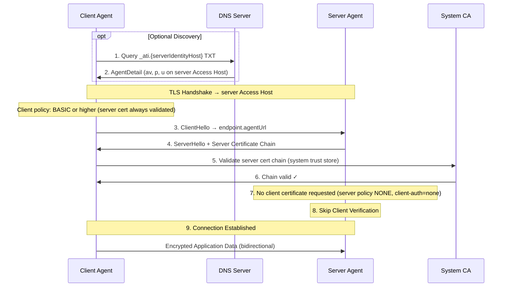
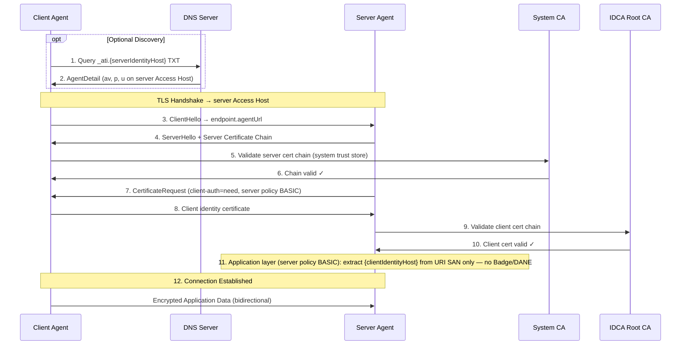
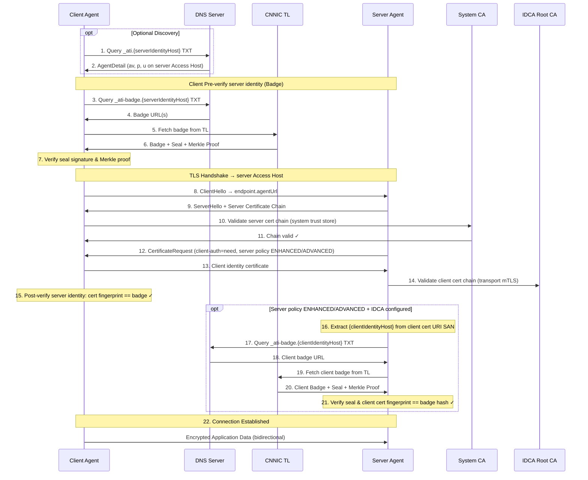
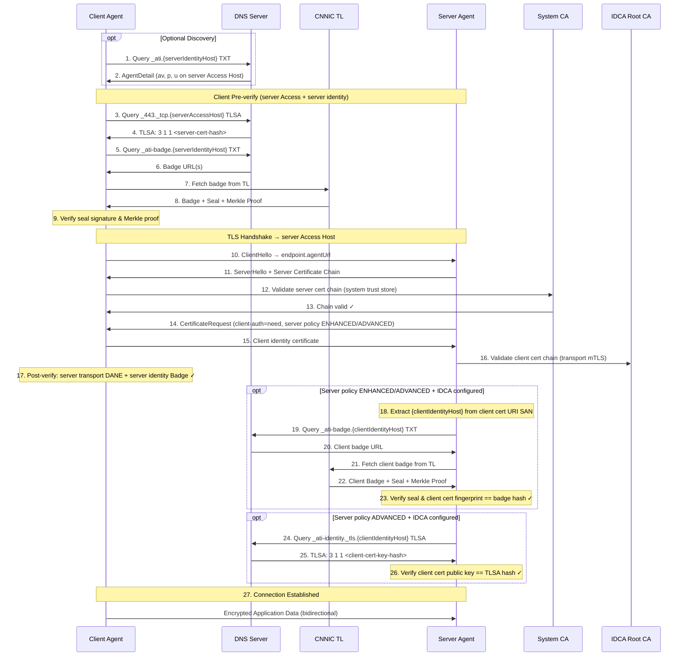

# ATI Java SDK

> Agent Trust Infrastructure (ATI) Java SDK — secure agent-to-agent communication with DNS TXT discovery, DANE TLSA verification, and transparency log attestation.

[English](README.md) | [中文](README.zh-CN.md)

## Features

- **DNS TXT agent discovery** — resolve agents via `_ati.{identityHost}` TXT records with optional SemVer constraints
- **DANE TLSA verification** — verify server certificates via DNS TLSA records
- **Badge verification** — cryptographically verify agent registration via the CNNIC Transparency Log
- **IDCA CRL certificate revocation (server)** — PKIX CRL from CDP at the TLS layer when IDCA trust is configured (embedded Tomcat)
- **mTLS secure connections** — mutual TLS with identity certificate support
- **SCITT transparency headers (planned)** — auditable HTTP attestation via Receipt and Status Token; low-level infrastructure exists in `ati-sdk-transparency`, not yet wired into Connection verification
- **Spring Boot auto-configuration** — zero-config integration with `ati.sdk.*` properties

## Verification Policies

| Policy | TLS | DANE | Badge | Scope | Description |
|--------|-----|------|-------|-------|-------------|
| `NONE` | - | - | - | Server only | No inbound client auth (dev/test only) |
| `BASIC` | ✓ | - | - | Client & server | Standard TLS only |
| `ENHANCED` | ✓ | - | ✓ | Client & server | TLS + Badge verification (default) |
| `ADVANCED` | ✓ | ✓ | ✓ | Client & server | TLS + DANE + Badge |

Client agents must use `BASIC`, `ENHANCED`, or `ADVANCED` — they always validate the server certificate. `NONE` is configured only on the server (`ati.sdk.server.verification.policy`).

## Verification Sequence Diagrams

Two service modes. `{serverIdentityHost}` is the server agent's **Identity Hostname** (`identityHost`); `{clientIdentityHost}` is the client agent's Identity Hostname. `{serverAccessHost}` appears only when the two FQDNs differ.

**Notes:**

- **Discovery (steps 1–2)** is optional — skip when connecting directly via a known `agentUrl`.
- **Client and server policies are configured independently** — e.g. client `ENHANCED` does not imply the server runs steps 16–21 unless the server policy is also `ENHANCED` or `ADVANCED` and IDCA is configured.
- **Server-side dual-track revocation** — when IDCA is configured, **Certificate Revocation** (CRL at TLS) and **Registration Revocation** (Badge at Client Verification) are independent; either failure rejects. See [Server-side dual-track revocation](#server-side-dual-track-revocation).
- **`NONE` is server-only** — clients cannot set `NONE`; they always validate the server certificate (minimum `BASIC`).
- **`client-auth`** on the server is derived from `ati.sdk.server.verification.policy` (not set separately): `NONE` → none, `BASIC`/`ENHANCED`/`ADVANCED` → need. See [ADR-0008](docs/adr/0008-server-basic-requires-identity-certificate.md).

### Independent Domain Mode

One agent owns a dedicated domain. **Identity Hostname = Access Hostname** (`identityHost` = `accessHost`). RA requires the Identity Hostname to equal the `u=` host. In the diagrams, `{serverIdentityHost}` equals `{serverAccessHost}`.

| Name | Definition | Example |
|------|------------|---------|
| **Server Identity Hostname** `{serverIdentityHost}` | Unique identity of the **server agent** — Discovery, Badge, TLS, and `agentUrl` all use this FQDN | `agent.example.com` |
| **Client Identity Hostname** `{clientIdentityHost}` | Unique identity of the **client agent**; extracted from the client Identity Certificate URI SAN when the server verifies the caller | `caller.example.com` |

Example endpoint: `u=https://agent.example.com/mcp` — host equals `identityHost`.

DNS lookups in the diagrams (server-side records on one FQDN):

| Hostname | Records |
|----------|---------|
| `{serverIdentityHost}` | `_ati` (Discovery), `_ati-badge` (Badge), `_443._tcp` (transport DANE) |
| `{clientIdentityHost}` | `_ati-badge`, `_ati-identity._tls` (server-side Client Verification) |

### Shared Domain Mode

Multiple agents share one **Access Hostname**; each agent's **Identity Hostname** is a **first-level subdomain** of that Access Hostname (the **immediate parent**, not the eTLD+1). RA requires the Identity Hostname to be a first-level subdomain of the `u=` host.

| Name | Definition | Example |
|------|------------|---------|
| **Server Identity Hostname** `{serverIdentityHost}` | Unique identity of the **server agent** — Discovery, Badge, identity DNS | `abc123.bailian.aliyun.com` |
| **Server Access Hostname** `{serverAccessHost}` | Immediate parent of the Identity Hostname — TLS and `agentUrl` connect here | `bailian.aliyun.com` |
| **Client Identity Hostname** `{clientIdentityHost}` | Unique identity of the **client agent**; extracted from the client Identity Certificate URI SAN | `xyz789.caller.example.com` |

Example endpoint: `u=https://bailian.aliyun.com/agents/abc123/mcp` — host is Access; Discovery queries `_ati.abc123.bailian.aliyun.com`.

DNS lookups in the diagrams:

| Hostname | Records |
|----------|---------|
| `{serverIdentityHost}` | `_ati` (Discovery), `_ati-badge` (Badge) |
| `{serverAccessHost}` | `_443._tcp` (server transport DANE) |
| `{clientIdentityHost}` | `_ati-badge`, `_ati-identity._tls` (server-side Client Verification) |

### NONE (L0): Server-side No Authentication (dev/test only)

Server policy only (`ati.sdk.server.verification.policy`). The client always validates the server certificate (client policy `BASIC` or higher).



### BASIC (L1): Agent Discovery + Standard TLS



### ENHANCED (L2): TLS + Transparency Log Verification

Client policy `ENHANCED`. Server-side steps 16–21 run only when **server policy is ENHANCED or ADVANCED** and **IDCA trust is configured** (`client-auth=need`).



### ADVANCED (L3): Full Verification

Client policy `ADVANCED`. Client-side transport DANE runs for every `ADVANCED` connection. Server-side Client Verification (Badge, and client DANE when server policy is `ADVANCED`) runs only when **IDCA is configured** (`client-auth=need`).



## Modules

| Module | Description |
|--------|-------------|
| [`ati-sdk-core`](ati-sdk-core/README.md) | Configuration, authentication, HTTP, utilities |
| [`ati-sdk-discovery`](ati-sdk-discovery/README.md) | Agent resolution via DNS `_ati` TXT |
| [`ati-sdk-transparency`](ati-sdk-transparency/README.md) | Transparency log verification (+ SCITT infrastructure, planned) |
| [`ati-sdk-agent-client`](ati-sdk-agent-client/README.md) | Secure agent-to-agent connections |
| [`ati-sdk-spring-boot-starter`](ati-sdk-spring-boot-starter/README.md) | Spring Boot auto-configuration |

## Installation

### Gradle

```kotlin
// Spring Boot (recommended, includes all modules)
implementation("com.aliyun.ati:ati-sdk-spring-boot-starter:0.1.0")

// Or individual modules
implementation("com.aliyun.ati:ati-sdk-agent-client:0.1.0")     // client-side connection
implementation("com.aliyun.ati:ati-sdk-discovery:0.1.0")         // agent discovery
implementation("com.aliyun.ati:ati-sdk-transparency:0.1.0")      // transparency log
```

### Maven

```xml
<dependency>
  <groupId>com.aliyun.ati</groupId>
  <artifactId>ati-sdk-spring-boot-starter</artifactId>
  <version>0.1.0</version>
</dependency>
```

## Quick Start

### Agent Registration

Agent registration is completed in the [Alibaba Cloud ATI Console](https://dnsnext.console.aliyun.com/ati/agents). The registration flow:

```
┌──────────────┐    ┌──────────────┐    ┌──────────────┐    ┌──────────────┐
│   Generate   │───▶│    Submit    │───▶│  ACME + DNS  │───▶│    ACTIVE    │
│ Identity CSR │    │  to Console  │    │ Verification │    │(Discoverable)│
└──────────────┘    └──────────────┘    └──────────────┘    └──────────────┘
```

1. **Generate identity key pair** — Create RSA/EC key pair for identity certificate (offline)
2. **Generate identity CSR** — Create Certificate Signing Request with an `ati://` URI SAN (Identity Hostname)
3. **Submit registration** — Input service certificate + identity CSR in ATI Console with Identity Hostname, version, endpoints (service certificate is user-provided)
4. **ACME verification** — Add DNS TXT record for domain ownership proof
5. **Identity certificate issuance** — CNNIC issues the identity certificate via IDCA (service certificate is user-provided, not issued by CNNIC or the RA)
6. **DNS verification** — Add TLSA and badge DNS records
7. **Active** — Agent is discoverable via `_ati.{identityHost}` DNS TXT

> **Note:** All steps are performed in the ATI Console. No SDK code is needed for registration.

### DNS TXT records

Published on the **Identity Hostname**. Semicolon-separated KV; key order is not significant. This SDK parses **`ati1`** (Discovery) and **`ati-badge1`** (Badge) only.

**Discovery TXT** (`_ati.{identityHost}`) — one record per Protocol (`p=` is lowercase `mcp`, `a2a`, or `http-api`):

```
_ati.abc123.bailian.aliyun.com.  TXT  "v=ati1; av=v1.0.0; p=mcp; u=https://bailian.aliyun.com/agents/abc123/mcp"
_ati.abc123.bailian.aliyun.com.  TXT  "v=ati1; av=v1.0.0; p=a2a; u=https://bailian.aliyun.com/agents/abc123/a2a"
```

Optional `m=direct` may be appended; when omitted, Discovery Mode is `direct`. `u=` is the **agentUrl** on the Access Hostname (in Independent Domain Mode, that host equals `identityHost`).

**Badge TXT** (`_ati-badge.{identityHost}`):

```
_ati-badge.abc123.bailian.aliyun.com.  TXT  "v=ati-badge1; av=v1.0.0; u=https://ati-tl.cnnic.cn:8180/tl/agents/6bf2b7a9-1383-4e33-a945-845f34af7526"
```

`av=` uses the same agentVersion grammar as Discovery. Verification extracts the path from `u=` and requests `TransparencyClient.baseUrl` + that path — the Badge TXT `u=` host is not the HTTP target.

### Agent Discovery

Resolve agent information via DNS TXT on the Identity Hostname:

```java
import com.aliyun.ati.sdk.discovery.AtiDiscoveryClient;
import com.aliyun.ati.sdk.discovery.AgentDetail;

AtiDiscoveryClient client = new AtiDiscoveryClient();

// Resolve by Identity Hostname with optional SemVer constraint
AgentDetail agent = client.discover("abc123.bailian.aliyun.com", "^1.0.0");
System.out.println("Identity host: " + agent.getAgentHost());
System.out.println("Access host: " + agent.getAccessHost());
System.out.println("Endpoints: " + agent.getEndpoints());

// Resolve latest version
AgentDetail latest = client.discover("abc123.bailian.aliyun.com");
```

### Agent-to-Agent Connections

TLS connects to the **Access Hostname** (`agentUrl` host). Badge lookups use the **Identity Hostname** — set `ConnectOptions.identityHost` (`AgentDetail.getAgentHost()`). In **Shared Domain Mode** the two FQDNs differ; in **Independent Domain Mode** they are the same. After Discovery, select the endpoint for your protocol from `detail.getEndpoints()` (one entry per protocol at the selected version):

```java
import com.aliyun.ati.sdk.agent.AtiClient;
import com.aliyun.ati.sdk.agent.AtiVerifiedClient;
import com.aliyun.ati.sdk.agent.AtiConnection;
import com.aliyun.ati.sdk.agent.ConnectOptions;
import com.aliyun.ati.sdk.agent.VerificationPolicy;
import com.aliyun.ati.sdk.agent.connection.AgentConnection;
import com.aliyun.ati.sdk.agent.http.auth.HttpAuthHeadersProvider;
import com.aliyun.ati.sdk.discovery.AtiDiscoveryClient;
import com.aliyun.ati.sdk.discovery.AgentDetail;
import com.aliyun.ati.sdk.discovery.AgentEndpoint;
import com.aliyun.ati.sdk.exception.AtiNotFoundException;
import com.aliyun.ati.sdk.transparency.TransparencyClient;

import java.nio.file.Path;

TransparencyClient tl = TransparencyClient.builder()
    .baseUrl("https://ati-tl.cnnic.cn:8180")
    .build();

AtiDiscoveryClient discovery = new AtiDiscoveryClient();
AtiClient client = AtiClient.create();

// Discover → pick endpoint by protocol → connect
AgentDetail detail = discovery.discover("abc123.bailian.aliyun.com", "^1.0.0");
String agentUrl = detail.getEndpoints().stream()
    .filter(e -> "MCP".equals(e.getProtocol()))
    .map(AgentEndpoint::getAgentUrl)
    .findFirst()
    .orElseThrow(() -> new AtiNotFoundException("Endpoint", "MCP"));

AgentConnection conn = client.connect(agentUrl,
    ConnectOptions.builder()
        // Shared Domain Mode: agentUrl host is accessHost; Badge lookups need identityHost
        .identityHost(detail.getAgentHost())
        .verificationPolicy(VerificationPolicy.ENHANCED)
        .transparencyClient(tl)
        .build());

// Independent Domain Mode — identityHost equals accessHost; ADVANCED adds transport DANE
AgentConnection direct = client.connect(
    "https://agent.example.com/mcp",
    ConnectOptions.builder()
        .identityHost("agent.example.com")
        .verificationPolicy(VerificationPolicy.ADVANCED)
        .transparencyClient(tl)
        .build());

// mTLS client certificate + Bearer token (ADVANCED: identityHost + accessHost for DANE)
AgentConnection mtls = client.connect(agentUrl,
    ConnectOptions.builder()
        .identityHost(detail.getAgentHost())    // Badge
        .accessHost(detail.getAccessHost())     // _443._tcp transport DANE
        .verificationPolicy(VerificationPolicy.ADVANCED)
        .transparencyClient(tl)
        .clientCertPath(Path.of("/path/to/client.crt"), Path.of("/path/to/client.key"))
        .authProvider(HttpAuthHeadersProvider.bearer("token"))
        .build());
```

For PKCS12 keystore-based setup, use `AtiVerifiedClient` when the **agentUrl host equals the Identity Hostname** (Independent Domain Mode). Shared Domain Mode requires `AtiClient` + `ConnectOptions` as shown above:

```java
AtiVerifiedClient verifiedClient = AtiVerifiedClient.builder()
    .keyStorePath("/path/to/identity.p12", "password")
    .transparencyClient(tl)
    .policy(VerificationPolicy.ENHANCED)
    .build();

// Independent Domain Mode: https://agent.example.com/mcp — host is both accessHost and identityHost
AtiConnection conn = verifiedClient.connect("https://agent.example.com/mcp");
```

### Spring Boot Auto-Configuration

`application.yml` (client side):

```yaml
ati:
  sdk:
    mode: client
    identity:
      certificate: /path/to/identity.crt
      private-key: /path/to/identity.key
    transparency:
      base-url: https://ati-tl.cnnic.cn:8180
    verification:
      # BASIC | ENHANCED | ADVANCED (NONE is server-only)
      policy: ENHANCED
    client:
      dns-timeout: 5s
      connect-timeout: 10s
```

`application.yml` (server side):

```yaml
ati:
  sdk:
    mode: server
    server:
      certificate: /path/to/server.crt
      private-key: /path/to/server.key
      port: 443
      verification:
        # NONE | BASIC | ENHANCED | ADVANCED (aligned with ATI Console L0–L3)
        # Drives TLS client-auth automatically — do not set server.ssl.client-auth separately
        policy: BASIC          # L1: require client cert (client-auth=need)
        # policy: ENHANCED     # L2: require client cert (client-auth=need)
        # policy: ADVANCED     # L3: require client cert + DANE client verification
        # policy: NONE         # L0: dev/test only (client-auth=none)
      idca:
        # Optional override: replaces the SDK-shipped production IDCA Chain (Root + Intermediate).
        # Omit to use the bundled CNNIC/UniTrust production chain. Required only for Test IDCA Chain
        # or a rotated production pair. Never merged with the shipped chain.
        # trust-certificate: /path/to/idca-chain.pem
    transparency:
      base-url: https://ati-tl.cnnic.cn:8180
```

### Server-side dual-track revocation

When server policy is not `NONE`, inbound client Identity Certificates are checked on two independent tracks. The SDK loads the shipped production **IDCA Chain** as trust material unless `ati.sdk.server.idca.trust-certificate` replaces it:

| Track | Layer | Mechanism | Server policies |
|-------|-------|-----------|-----------------|
| **Certificate Revocation** | TLS (mTLS handshake) | PKIX CRL from CDP on the certificate chain | `BASIC`, `ENHANCED`, `ADVANCED` |
| **Registration Revocation** | Application (Client Verification) | TL Badge registration status | `ENHANCED`, `ADVANCED` |

Either failure rejects the connection. There is no operator-configured CRL URL — the SDK reads **CDP** from the presented chain (leaf, then issuing CA). No CDP → CRL skipped (debug log). CDP present but fetch/signature failure → handshake rejected (fail-closed).

**Embedded Tomcat only** for TLS-layer CRL. Other embedded containers log a warning and skip CRL until supported. See [ADR-0004](docs/adr/0004-idca-crl-revocation.md).

### Replacing the shipped IDCA Chain (no SDK upgrade)

The default trust material is the production **IDCA Chain** bundled in the SDK (exactly one Root + one Intermediate). When CNNIC issues a new Intermediate, or a test environment needs the **Test IDCA Chain**, **do not wait for an SDK release**: concatenate the new pair into a PEM and set the override path. The override replaces the shipped chain entirely (never merged). `NONE` does not load the chain; an override has no effect under that policy.

```yaml
ati:
  sdk:
    server:
      verification:
        policy: ENHANCED   # BASIC / ENHANCED / ADVANCED load the chain
      idca:
        trust-certificate: /etc/ati/idca-chain.pem   # exactly two certs: Root + Intermediate
```

PEM shape (order does not matter; the SDK identifies the self-signed Root and the Intermediate it issued):

```
-----BEGIN CERTIFICATE-----
# IDCA Root
-----END CERTIFICATE-----
-----BEGIN CERTIFICATE-----
# IDCA Intermediate
-----END CERTIFICATE-----
```

This is a hard cutover: one process trusts one pair. Identity Certificates from the previous Intermediate are rejected after the switch. The bundled pair is updated in a later SDK release. See [ADR-0005](docs/adr/0005-sdk-ships-idca-chain.md).

Set `ati.sdk.mode` to control which side to enable:

| Mode | Client Beans | Server Beans |
|------|-------------|-------------|
| `client` | Yes | No |
| `server` | No | Yes |
| `both` | Yes | Yes |

## Configuration

### Transparency Log

The Transparency Log (TL) stores agent Badges and is **operated by CNNIC only** — there is no separate Alibaba Cloud TL service. RA (Alibaba Cloud ATI) handles registration; CNNIC TL holds the append-only Badge records used for verification.

`TransparencyClient` connects to CNNIC TL to verify agent badges and seals:

```java
// Production default — CNNIC TL
TransparencyClient tl = TransparencyClient.builder()
    .baseUrl(TransparencyClient.CNNIC_BASE_URL)   // https://ati-tl.cnnic.cn:8180
    .build();

// Custom timeouts and root key cache TTL
TransparencyClient tl = TransparencyClient.builder()
    .baseUrl(TransparencyClient.CNNIC_BASE_URL)
    .connectTimeout(Duration.ofSeconds(5))
    .readTimeout(Duration.ofSeconds(15))
    .rootKeyCacheTtl(Duration.ofHours(12))   // default: 24 hours
    .build();
```

### Verification Policy

Configure the verification level via `ConnectOptions`:

```java
// BASIC — TLS with system CA only
ConnectOptions opts = ConnectOptions.builder()
    .verificationPolicy(VerificationPolicy.BASIC)
    .build();

// ENHANCED — TLS + ATI Badge (Shared Domain Mode: set identityHost)
ConnectOptions opts = ConnectOptions.builder()
    .identityHost("abc123.bailian.aliyun.com")
    .verificationPolicy(VerificationPolicy.ENHANCED)
    .transparencyClient(tl)
    .build();

// ADVANCED — ENHANCED + transport DANE (_443._tcp on accessHost)
ConnectOptions opts = ConnectOptions.builder()
    .identityHost("abc123.bailian.aliyun.com")
    .accessHost("bailian.aliyun.com")
    .verificationPolicy(VerificationPolicy.ADVANCED)
    .transparencyClient(tl)
    .build();
```

### mTLS Client Certificate

For mutual TLS authentication, provide a client certificate via `ConnectOptions`:

```java
// From PEM file paths
ConnectOptions opts = ConnectOptions.builder()
    .verificationPolicy(VerificationPolicy.ENHANCED)
    .transparencyClient(tl)
    .clientCertPath(Path.of("/path/to/client.crt"))
    .clientKeyPath(Path.of("/path/to/client.key"))
    .build();

// Or from in-memory objects
ConnectOptions opts = ConnectOptions.builder()
    .clientCertificate(x509Cert, privateKey)
    .build();
```

For `AtiVerifiedClient`, use a PKCS12 keystore:

```java
AtiVerifiedClient client = AtiVerifiedClient.builder()
    .keyStorePath("/path/to/keystore.p12", "password")
    .transparencyClient(tl)
    .policy(VerificationPolicy.ENHANCED)
    .build();
```

### Authentication

Add authentication headers to agent requests via `HttpAuthHeadersProvider`:

```java
// Bearer token
ConnectOptions opts = ConnectOptions.builder()
    .authProvider(HttpAuthHeadersProvider.bearer("eyJhbGciOiJSUzI1NiIs..."))
    .build();

// API key (sso-key format)
ConnectOptions opts = ConnectOptions.builder()
    .authProvider(HttpAuthHeadersProvider.apiKey("my-key", "my-secret"))
    .build();

// Custom header
ConnectOptions opts = ConnectOptions.builder()
    .authProvider(HttpAuthHeadersProvider.header("X-Custom-Auth", "value"))
    .build();

// Multiple headers
ConnectOptions opts = ConnectOptions.builder()
    .authProvider(HttpAuthHeadersProvider.headers(Map.of(
        "X-Api-Key", "key123",
        "X-Tenant-Id", "tenant456"
    )))
    .build();
```

### Timeouts and Retries

```java
AtiConfiguration config = AtiConfiguration.builder()
    .environment(Environment.PROD)
    .connectTimeout(Duration.ofSeconds(5))
    .readTimeout(Duration.ofSeconds(30))
    .enableRetry(3)  // Max 3 retry attempts
    .build();
```

### TLSA Port Override

When connecting through a proxy on a non-standard port, override the TLSA lookup port so DANE verification queries the correct DNS record:

```java
AtiVerifiedClient client = AtiVerifiedClient.builder()
    .keyStorePath("/path/to/keystore.p12", "password")
    .transparencyClient(tl)
    .policy(VerificationPolicy.ADVANCED)
    .tlsaPort(443)  // Always query _443._tcp.{accessHost} TLSA records
    .build();
```

### Spring Boot

When using `ati-sdk-spring-boot-starter`, configure via `application.yml` under the `ati.sdk` prefix:

```yaml
ati:
  sdk:
    mode: client
    identity:
      certificate: /path/to/identity.crt
      private-key: /path/to/identity.key
    transparency:
      base-url: https://ati-tl.cnnic.cn:8180
    verification:
      policy: ENHANCED
    client:
      dns-timeout: 5s
      connect-timeout: 10s
```

| Property | Description | Default |
|----------|-------------|--------|
| `ati.sdk.mode` | SDK mode: `client`, `server`, or `both` | `client` |
| `ati.sdk.transparency.base-url` | CNNIC Transparency Log base URL | `https://ati-tl.cnnic.cn:8180` |
| `ati.sdk.verification.policy` | Client verification policy | `ENHANCED` |
| `ati.sdk.server.verification.policy` | Server verification policy (`NONE` is server-only) | `BASIC` |
| `ati.sdk.server.idca.trust-certificate` | Optional IDCA Chain PEM override (exactly 2 certs; replaces shipped chain) | shipped production IDCA Chain |
| `ati.sdk.client.dns-timeout` | DNS lookup timeout | `5s` |
| `ati.sdk.client.connect-timeout` | HTTP connect timeout | `10s` |

## Error Handling

The SDK uses a hierarchy of exceptions for different error types:

```java
try {
    AgentConnection conn = client.connect("https://agent.example.com", options);
    String response = conn.httpApiAt("https://agent.example.com").get("/api/data");
} catch (AtiNotFoundException e) {
    // Agent or resource not found (404)
    System.err.println("Not found: " + e.getResourceType() + ": " + e.getResourceId());
} catch (AtiAuthenticationException e) {
    // Authentication failed (401/403)
    System.err.println("Auth error: " + e.getMessage());
} catch (AtiValidationException e) {
    // Request validation error (422)
    System.err.println("Validation error: " + e.getMessage());
    e.getFieldErrors().forEach((field, msg) ->
        System.err.println("  " + field + ": " + msg));
} catch (AtiConflictException e) {
    // Resource conflict (409)
    System.err.println("Conflict: " + e.getMessage());
} catch (AtiServerException e) {
    // Server error (5xx)
    System.err.println("Server error (" + e.getStatusCode() + "): " + e.getMessage());
    System.err.println("Request ID: " + e.getRequestId());
    if (e.isRetryable()) {
        // Retry after a delay
    }
} catch (AtiException e) {
    // Any other SDK error (verification failure, TLS error, etc.)
    System.err.println("Error: " + e.getMessage());
}
```

| Exception | HTTP Status | Description |
|-----------|-------------|-------------|
| `AtiException` | — | Base exception for all SDK errors |
| `AtiNotFoundException` | 404 | Agent or resource not found |
| `AtiAuthenticationException` | 401/403 | Invalid or expired credentials |
| `AtiValidationException` | 422 | Request validation failure (includes field errors) |
| `AtiConflictException` | 409 | Resource already exists or conflicting operation |
| `AtiServerException` | 5xx | Server-side error (retryable) |

All exceptions extend `AtiException` and may carry a `requestId` for support purposes:

```java
} catch (AtiException e) {
    String requestId = e.getRequestId();  // may be null for client-side errors
}
```

## Build

```bash
./gradlew clean build
```

Requirements: Java 17+, Gradle 8.5+

## Version Constraints

When discovering agents, you can specify a version constraint to select a specific agent version:

| Constraint | Matches |
|------------|--------|
| `1.2.3` | Exact version 1.2.3 |
| `^1.2.0` | Compatible with 1.2.0 (>=1.2.0 <2.0.0) |
| `~1.2.0` | Approximately 1.2.0 (>=1.2.0 <1.3.0) |

To select the latest version, **omit the version parameter** (do not pass `"*"` — it is not treated as a wildcard).

```java
AtiDiscoveryClient client = new AtiDiscoveryClient();

// Exact version
AgentDetail agent = client.discover("abc123.bailian.aliyun.com", "1.0.0");

// Any 1.x version
AgentDetail agent = client.discover("abc123.bailian.aliyun.com", "^1.0.0");

// Any 1.2.x version
AgentDetail agent = client.discover("abc123.bailian.aliyun.com", "~1.2.0");

// Latest version (omit version parameter)
AgentDetail latest = client.discover("abc123.bailian.aliyun.com");
```

Version constraints are evaluated client-side against `av` values in Discovery TXT records using SemVer matching.

## License

[MIT](LICENSE)

## Contributing

See [CONTRIBUTING.md](CONTRIBUTING.md)
