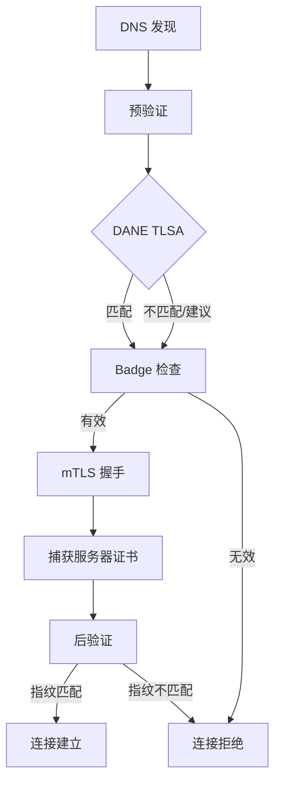

# ATI Java SDK

> Agent 信任基础设施 (ATI) Java SDK — 通过 DNS 发现、DANE TLSA 验证和透明日志认证，实现安全的 Agent 间通信。

[English](README.md) | [中文](README.zh-CN.md)

## 特性

- **基于 DNS 的 Agent 发现** — 通过 ATI Name（`ati://v{version}.{agentHost}`）解析 Agent
- **DANE TLSA 验证** — 通过 DNS TLSA 记录验证服务器证书
- **Badge 验证** — 通过透明日志加密验证 Agent 注册信息
- **mTLS 安全连接** — 支持身份证书的双向 TLS
- **SCITT 透明性头** — 签名的透明性头，用于可审计的 Agent 交互
- **Spring Boot 自动配置** — 通过 `ati.sdk.*` 属性实现零配置集成

## 验证策略

| 策略 | DANE | Badge | 说明 |
|------|------|-------|------|
| `PKI_ONLY` | 禁用 | 禁用 | 仅标准 TLS |
| `BADGE_REQUIRED` | 禁用 | 必须 | 需要 Badge 验证（默认） |
| `DANE_AND_BADGE` | 必须 | 必须 | DANE 和 Badge 均需验证 |

## 验证流程



## 模块

| 模块 | 说明 |
|------|------|
| [`ati-sdk-core`](ati-sdk-core/README.md) | 配置、认证、HTTP、工具类 |
| [`ati-sdk-discovery`](ati-sdk-discovery/README.md) | 基于 DNS 的 Agent 解析 |
| [`ati-sdk-transparency`](ati-sdk-transparency/README.md) | 透明日志 + SCITT 验证 |
| [`ati-sdk-agent-client`](ati-sdk-agent-client/README.md) | 安全的 Agent 间连接 |
| [`ati-sdk-spring-boot-starter`](ati-sdk-spring-boot-starter/README.md) | Spring Boot 自动配置 |

## 安装

### Gradle

```kotlin
// Spring Boot（推荐，包含所有模块）
implementation("com.aliyun.ati:ati-sdk-spring-boot-starter:0.1.0")

// 或按需引入单个模块
implementation("com.aliyun.ati:ati-sdk-agent-client:0.1.0")     // 客户端连接
implementation("com.aliyun.ati:ati-sdk-discovery:0.1.0")         // Agent 发现
implementation("com.aliyun.ati:ati-sdk-transparency:0.1.0")      // 透明日志
```

### Maven

```xml
<dependency>
  <groupId>com.aliyun.ati</groupId>
  <artifactId>ati-sdk-spring-boot-starter</artifactId>
  <version>0.1.0</version>
</dependency>
```

## 快速开始

### 客户端

`application.yml`：

```yaml
ati:
  sdk:
    mode: client
    discovery:
      endpoint: alidns.aliyuncs.com
      access-key-id: ${ATI_AK}
      access-key-secret: ${ATI_SK}
    identity:
      certificate: /path/to/identity.crt
      private-key: /path/to/identity.key
    transparency:
      base-url: https://ati-tl.cnnic.cn:8180
    verification:
      policy: BADGE_REQUIRED
    client:
      dns-timeout: 5s
      connect-timeout: 10s
```

Java：

```java
AtiVerifiedClient client = AtiVerifiedClient.builder()
    .keyStorePath("/path/to/identity.p12", "password")
    .policy(VerificationPolicy.BADGE_REQUIRED)
    .build();

AtiConnection conn = client.connect("https://agent.example.com",
    ConnectOptions.builder()
        .verificationPolicy(VerificationPolicy.BADGE_REQUIRED)
        .build());
```

### 服务端

`application.yml`：

```yaml
ati:
  sdk:
    mode: server
    server:
      certificate: /path/to/server.crt
      private-key: /path/to/server.key
      port: 443
      verification:
        policy: PKI_ONLY
      idca:
        trust-certificate: /path/to/idca-trust.pem
    transparency:
      base-url: https://ati-tl.cnnic.cn:8180
```

Java：

```java
@SpringBootApplication
public class ServerApplication {
    public static void main(String[] args) {
        SpringApplication.run(ServerApplication.class, args);
    }
}
```

### Spring Boot 自动配置

通过 `ati.sdk.mode` 控制启用哪一侧：

| 模式 | 客户端 Bean | 服务端 Bean |
|------|-----------|-----------|
| `client` | 是 | 否 |
| `server` | 否 | 是 |
| `both` | 是 | 是 |

## 构建

```bash
./gradlew clean build
```

环境要求：Java 17+、Gradle 8.5+

## 开源协议

[MIT](LICENSE)

## 贡献

参见 [CONTRIBUTING.md](CONTRIBUTING.md)
