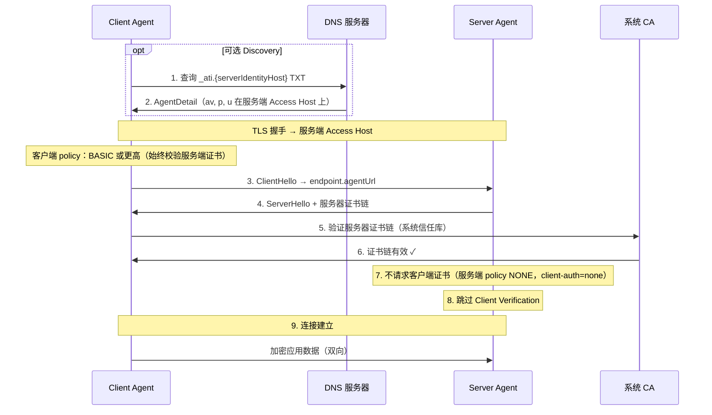
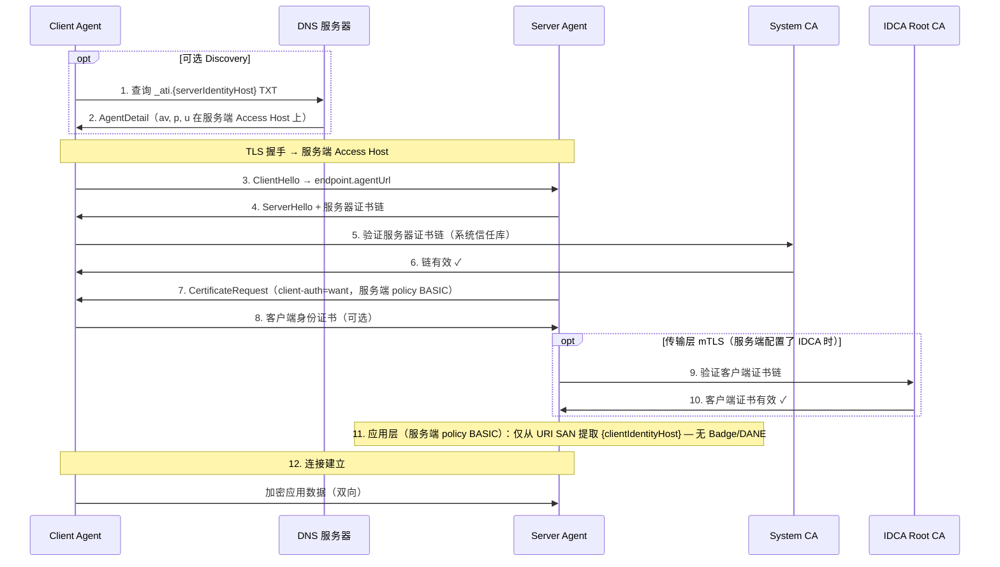
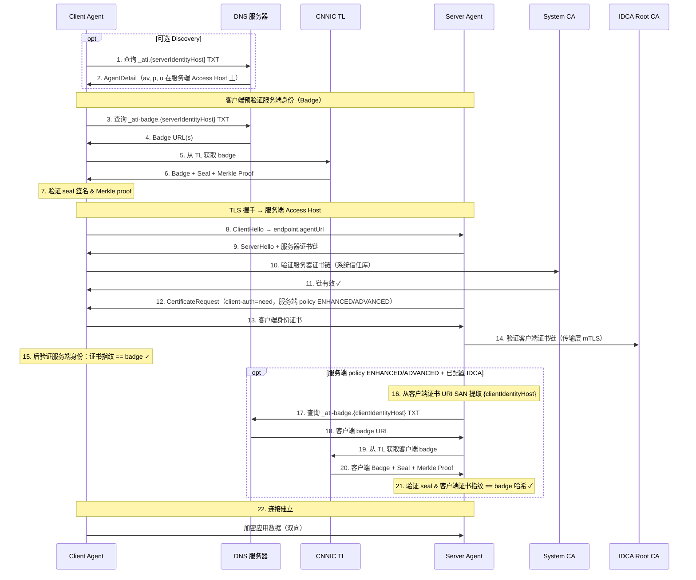
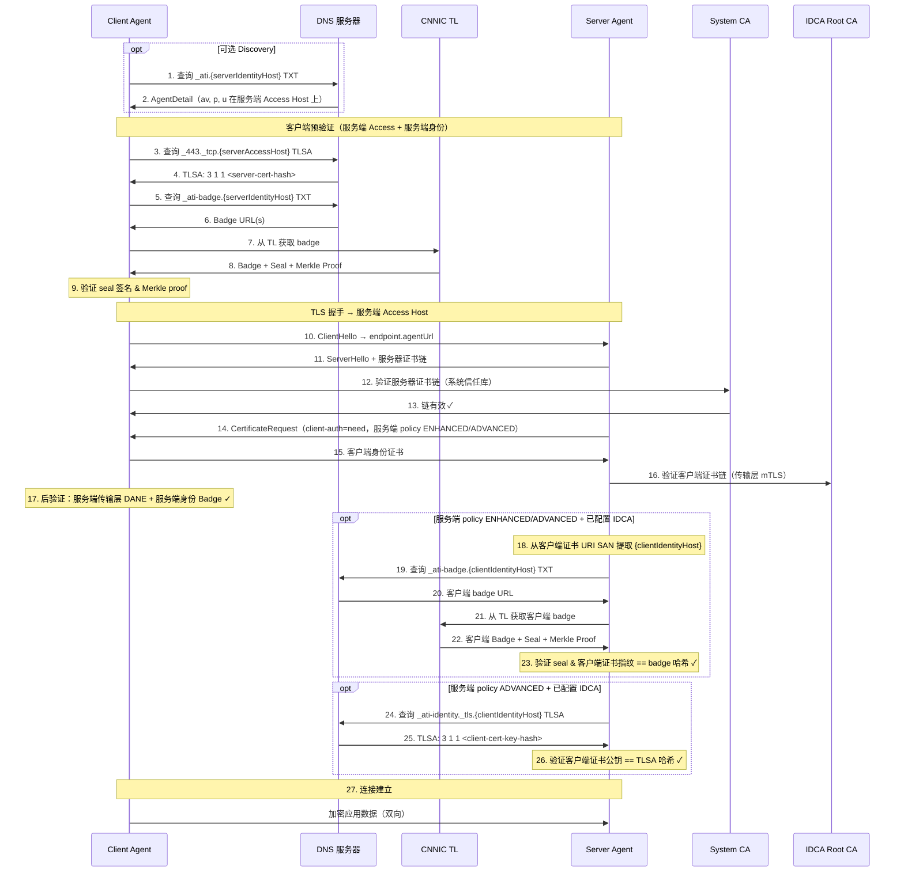

# ATI Java SDK

> Agent 信任基础设施 (ATI) Java SDK — 通过 DNS TXT 发现、DANE TLSA 验证和透明日志认证，实现安全的 Agent 间通信。

[English](README.md) | [中文](README.zh-CN.md)

## 特性

- **基于 DNS TXT 的 Agent 发现** — 通过 Identity Hostname 上的 `_ati` TXT 记录解析 Agent，支持 SemVer 版本约束
- **DANE TLSA 验证** — 通过 DNS TLSA 记录验证服务器证书
- **Badge 验证** — 通过 CNNIC 透明日志（Transparency Log）加密验证 Agent 注册信息
- **IDCA CRL 证书吊销（服务端）** — 配置 IDCA 信任时在 TLS 层通过 CDP/CRL 校验客户端 Identity Certificate（嵌入式 Tomcat）
- **mTLS 安全连接** — 支持身份证书的双向 TLS
- **SCITT 透明性头（计划中）** — 通过 Receipt 与 Status Token 实现可审计的 HTTP 证明；`ati-sdk-transparency` 已有底层基础设施，尚未接入 Connection 验证流程
- **Spring Boot 自动配置** — 通过 `ati.sdk.*` 属性实现零配置集成

## 验证策略

| 策略 | TLS | DANE | Badge | 适用范围 | 说明 |
|------|-----|------|-------|----------|------|
| `NONE` | - | - | - | 仅服务端 | 无入站客户端认证（仅开发/测试） |
| `BASIC` | ✓ | - | - | 客户端 & 服务端 | 仅标准 TLS |
| `ENHANCED` | ✓ | - | ✓ | 客户端 & 服务端 | TLS + Badge 验证（默认） |
| `ADVANCED` | ✓ | ✓ | ✓ | 客户端 & 服务端 | TLS + DANE + Badge |

客户端 Agent 必须使用 `BASIC`、`ENHANCED` 或 `ADVANCED`，且始终校验服务端证书。`NONE` 仅可在服务端配置（`ati.sdk.server.verification.policy`）。

## 验证时序图

下方时序图使用 `{serverIdentityHost}`、`{serverAccessHost}` 与 `{clientIdentityHost}` 占位符。**单域名模式**下 `{serverIdentityHost}` 等于 `{serverAccessHost}` — Discovery、Badge 与传输层 DANE 均指向同一 FQDN。

**说明：**

- **Discovery（步骤 1–2）为可选** — 已知 `agentUrl` 直接连接时可跳过。
- **客户端与服务端 policy 独立配置** — 例如客户端 `ENHANCED` 不意味着服务端会执行步骤 16–21，除非服务端 policy 也为 `ENHANCED`/`ADVANCED` 且已配置 IDCA。
- **服务端双轨吊销** — 配置 IDCA 后，**Certificate Revocation**（TLS 层 CRL）与 **Registration Revocation**（Client Verification 层 Badge）相互独立，任一失败即拒绝。见 [服务端双轨吊销](#服务端双轨吊销)。
- **`NONE` 仅适用于服务端** — 客户端不能配置 `NONE`；客户端始终校验服务端证书（最低 `BASIC`）。
- **服务端 `client-auth`** 由 `ati.sdk.server.verification.policy` 自动派生（勿单独配置）：`NONE` → none，`BASIC` → want，`ENHANCED`/`ADVANCED` → need。

### 双 Hostname 模型（共享平台）

多个 Agent 共享一个 **Access Hostname**；每个 Agent 的 **Identity Hostname** 为其一级子域名。RA 要求 `agentHost` 为 `u=` host 的一级子域名。

| Hostname | 定义 | 示例 |
|----------|------|------|
| **服务端 Identity Hostname** `{serverIdentityHost}` | **服务端 Agent** 身份的唯一标识 — 用于发现 Agent、验证服务端是谁 | `abc123.bailian.aliyun.com` |
| **服务端 Access Hostname** `{serverAccessHost}` | 访问**服务端 Agent 服务**的通用域名 — TLS 与 `agentUrl` 均连接于此 | `bailian.aliyun.com` |
| **客户端 Identity Hostname** `{clientIdentityHost}` | **客户端 Agent** 身份的唯一标识 — 与服务端 Identity Hostname 对称；服务端验证调用方时，从客户端 Identity Certificate URI SAN 提取 | `xyz789.caller.example.com` |

示例 endpoint：`u=https://bailian.aliyun.com/agents/abc123/mcp` — host 为 Access；Discovery 查询 `_ati.abc123.bailian.aliyun.com`。

时序图中的 DNS 查询对应关系：

| Hostname | 记录 |
|----------|------|
| `{serverIdentityHost}` | `_ati`（Discovery）、`_ati-badge`（Badge） |
| `{serverAccessHost}` | `_443._tcp`（服务端传输层 DANE） |
| `{clientIdentityHost}` | `_ati-badge`、`_ati-identity._tls`（服务端 Client Verification） |

### 单 Hostname 模型

单个 Agent 独占一个域名；**Identity Hostname 等于 Access Hostname**。RA 要求 `agentHost` 等于 `u=` 的 host。

| Hostname | 定义 | 示例 |
|----------|------|------|
| **服务端 Identity Hostname** `{serverIdentityHost}` | 与 Access Hostname 相同 — 注册、Discovery、Badge 与 TLS 均在同一 FQDN | `agent.example.com` |
| **服务端 Access Hostname** `{serverAccessHost}` | 等于 `{serverIdentityHost}` | `agent.example.com` |
| **客户端 Identity Hostname** `{clientIdentityHost}` | 客户端 Agent 身份（不变 — 客户端也可采用单域名部署） | `caller.example.com` |

示例 endpoint：`u=https://agent.example.com/mcp` — host 等于 `agentHost`。

时序图中的 DNS 查询对应关系（服务端记录合并到同一 FQDN）：

| Hostname | 记录 |
|----------|------|
| `{serverIdentityHost}`（= `{serverAccessHost}`） | `_ati`（Discovery）、`_ati-badge`（Badge）、`_443._tcp`（传输层 DANE） |
| `{clientIdentityHost}` | `_ati-badge`、`_ati-identity._tls`（服务端 Client Verification） |

### NONE（L0）：服务端无认证（仅开发/测试）

仅服务端策略（`ati.sdk.server.verification.policy`）。客户端始终校验服务端证书（客户端 policy 为 `BASIC` 或更高）。



### BASIC（L1）：Agent 发现 + 标准 TLS



### ENHANCED（L2）：TLS + 透明日志验证

客户端 policy 为 `ENHANCED`。服务端步骤 16–21 仅在**服务端 policy 为 ENHANCED/ADVANCED 且已配置 IDCA** 时执行（`client-auth=need`）。



### ADVANCED（L3）：完整验证

客户端 policy 为 `ADVANCED`。客户端传输层 DANE 对所有 `ADVANCED` 连接生效。服务端 Client Verification（Badge，以及服务端 policy 为 `ADVANCED` 时的客户端 DANE）仅在**已配置 IDCA** 时执行（`client-auth=need`）。



## 模块

| 模块 | 说明 |
|------|------|
| [`ati-sdk-core`](ati-sdk-core/README.md) | 配置、认证、HTTP、工具类 |
| [`ati-sdk-discovery`](ati-sdk-discovery/README.md) | 通过 DNS `_ati` TXT 解析 Agent |
| [`ati-sdk-transparency`](ati-sdk-transparency/README.md) | 透明日志验证（+ SCITT 基础设施，计划中） |
| [`ati-sdk-agent-client`](ati-sdk-agent-client/README.md) | 安全的 Agent 间连接 |
| [`ati-sdk-spring-boot-starter`](ati-sdk-spring-boot-starter/README.md) | Spring Boot 自动配置 |

## 安装

### Gradle

```kotlin
// Spring Boot（推荐，包含所有模块）
implementation("com.aliyun.ati:ati-sdk-spring-boot-starter:0.1.0")

// 或按需引入单个模块
implementation("com.aliyun.ati:ati-sdk-agent-client:0.1.0")     // 客户端连接
implementation("com.aliyun.ati:ati-sdk-discovery:0.1.0")         // Agent 发现
implementation("com.aliyun.ati:ati-sdk-transparency:0.1.0")      // 透明日志
```

### Maven

```xml
<dependency>
  <groupId>com.aliyun.ati</groupId>
  <artifactId>ati-sdk-spring-boot-starter</artifactId>
  <version>0.1.0</version>
</dependency>
```

## 快速开始

### Agent 注册

Agent 注册在[阿里云 ATI 控制台](https://dnsnext.console.aliyun.com/ati/agents)完成。注册流程：

```
┌──────────────┐    ┌──────────────┐    ┌──────────────┐    ┌──────────────┐
│   Generate   │───▶│    Submit    │───▶│  ACME + DNS  │───▶│    ACTIVE    │
│ Identity CSR │    │  to Console  │    │ Verification │    │(Discoverable)│
└──────────────┘    └──────────────┘    └──────────────┘    └──────────────┘
```

1. **生成身份密钥对** — 线下为身份证书创建 RSA/EC 密钥对
2. **生成身份 CSR** — 创建包含 `ati://` URI SAN（Identity Hostname）的证书签名请求
3. **提交注册** — 在 ATI 控制台输入服务证书 + 身份 CSR，并注册 agentHost、version、endpoints（服务证书由用户提供）
4. **ACME 验证** — 添加 DNS TXT 记录证明域名所有权
5. **身份证书签发** — CNNIC 通过 IDCA 签发身份证书（服务证书由用户提供，非 CNNIC 或 RA 签发）
6. **DNS 验证** — 添加 TLSA 和 badge DNS 记录
7. **激活** — Agent 可通过 `_ati.{identityHost}` DNS TXT 发现

> **注意：** 所有步骤均在 ATI 控制台完成，注册过程不需要 SDK 代码。

### Agent 发现

通过 Identity Hostname 上的 DNS TXT 记录解析 Agent 信息：

```java
import com.aliyun.ati.sdk.discovery.AtiDiscoveryClient;
import com.aliyun.ati.sdk.discovery.AgentDetail;

AtiDiscoveryClient client = new AtiDiscoveryClient();

// 按 Identity Hostname 解析，可选 SemVer 约束
AgentDetail agent = client.discover("abc123.bailian.aliyun.com", "^1.0.0");
System.out.println("Identity host: " + agent.getAgentHost());
System.out.println("Access host: " + agent.getAccessHost());
System.out.println("Endpoints: " + agent.getEndpoints());

// 解析最新版本
AgentDetail latest = client.discover("abc123.bailian.aliyun.com");
```

### Agent 间连接

在**双 Hostname 模型**下，TLS 连接到 **Access Hostname**（`agentUrl` 的 host），而 Badge 与 identity DANE 查询使用 **Identity Hostname**。Discovery 之后，从 `detail.getEndpoints()` 中按 protocol 选择 endpoint（选中版本下每个 protocol 一条），再通过 `ConnectOptions` 传入两个 hostname：

```java
import com.aliyun.ati.sdk.agent.AtiClient;
import com.aliyun.ati.sdk.agent.AtiVerifiedClient;
import com.aliyun.ati.sdk.agent.AtiConnection;
import com.aliyun.ati.sdk.agent.ConnectOptions;
import com.aliyun.ati.sdk.agent.VerificationPolicy;
import com.aliyun.ati.sdk.agent.connection.AgentConnection;
import com.aliyun.ati.sdk.agent.http.auth.HttpAuthHeadersProvider;
import com.aliyun.ati.sdk.discovery.AtiDiscoveryClient;
import com.aliyun.ati.sdk.discovery.AgentDetail;
import com.aliyun.ati.sdk.discovery.AgentEndpoint;
import com.aliyun.ati.sdk.exception.AtiNotFoundException;
import com.aliyun.ati.sdk.transparency.TransparencyClient;

import java.nio.file.Path;

TransparencyClient tl = TransparencyClient.builder()
    .baseUrl("https://ati-tl.cnnic.cn:8180")
    .build();

AtiDiscoveryClient discovery = new AtiDiscoveryClient();
AtiClient client = AtiClient.create();

// 发现 → 按 protocol 选择 endpoint → 连接
AgentDetail detail = discovery.discover("abc123.bailian.aliyun.com", "^1.0.0");
String agentUrl = detail.getEndpoints().stream()
    .filter(e -> "MCP".equals(e.getProtocol()))
    .map(AgentEndpoint::getAgentUrl)
    .findFirst()
    .orElseThrow(() -> new AtiNotFoundException("Endpoint", "MCP"));

AgentConnection conn = client.connect(agentUrl,
    ConnectOptions.builder()
        // 双 hostname：agentUrl 的 host 即 accessHost；Badge 查询需指定 identityHost
        .identityHost(detail.getAgentHost())
        .verificationPolicy(VerificationPolicy.ENHANCED)
        .transparencyClient(tl)
        .build());

// 单域名 — identityHost 等于 accessHost；ADVANCED 额外做传输层 DANE
AgentConnection direct = client.connect(
    "https://agent.example.com/mcp",
    ConnectOptions.builder()
        .identityHost("agent.example.com")
        .verificationPolicy(VerificationPolicy.ADVANCED)
        .transparencyClient(tl)
        .build());

// mTLS 客户端证书 + Bearer token（ADVANCED：identityHost + accessHost 用于 DANE）
AgentConnection mtls = client.connect(agentUrl,
    ConnectOptions.builder()
        .identityHost(detail.getAgentHost())    // Badge
        .accessHost(detail.getAccessHost())     // _443._tcp 传输层 DANE
        .verificationPolicy(VerificationPolicy.ADVANCED)
        .transparencyClient(tl)
        .clientCertPath(Path.of("/path/to/client.crt"), Path.of("/path/to/client.key"))
        .authProvider(HttpAuthHeadersProvider.bearer("token"))
        .build());
```

使用 PKCS12 密钥库时，可用 `AtiVerifiedClient`（适用于 **agentUrl 的 host 等于 Identity Hostname** 的单域名部署）。双 hostname 模式请使用上文 `AtiClient` + `ConnectOptions`：

```java
AtiVerifiedClient verifiedClient = AtiVerifiedClient.builder()
    .keyStorePath("/path/to/identity.p12", "password")
    .transparencyClient(tl)
    .policy(VerificationPolicy.ENHANCED)
    .build();

// 单域名：https://agent.example.com/mcp — host 同时作为 access 与 identity
AtiConnection conn = verifiedClient.connect("https://agent.example.com/mcp");
```

### Spring Boot 自动配置

`application.yml`（客户端）：

```yaml
ati:
  sdk:
    mode: client
    identity:
      certificate: /path/to/identity.crt
      private-key: /path/to/identity.key
    transparency:
      base-url: https://ati-tl.cnnic.cn:8180
    verification:
      # BASIC | ENHANCED | ADVANCED（NONE 仅服务端）
      policy: ENHANCED
    client:
      dns-timeout: 5s
      connect-timeout: 10s
```

`application.yml`（服务端）：

```yaml
ati:
  sdk:
    mode: server
    server:
      certificate: /path/to/server.crt
      private-key: /path/to/server.key
      port: 443
      verification:
        # NONE | BASIC | ENHANCED | ADVANCED（与 ATI 控制台 L0–L3 对应）
        # 自动派生 TLS client-auth，请勿单独配置 server.ssl.client-auth
        policy: BASIC          # L1 基础认证：可选客户端证书（client-auth=want）
        # policy: ENHANCED     # L2 增强认证：必须客户端证书（client-auth=need）
        # policy: ADVANCED     # L3 高级认证：必须客户端证书 + DANE 客户端验证
        # policy: NONE         # L0 无认证：仅开发/测试（client-auth=none）
      idca:
        # 可选覆盖：整链替换 SDK 内嵌的生产 IDCA Chain（Root + Intermediate）。
        # 省略则使用内嵌的 CNNIC/UniTrust 生产链。仅测试链或轮换生产对时需要配置。
        # 与内嵌链互斥，不会合并。
        # trust-certificate: /path/to/idca-chain.pem
    transparency:
      base-url: https://ati-tl.cnnic.cn:8180
```

### 服务端双轨吊销

当服务端 policy 不为 `NONE` 时，入站客户端 Identity Certificate 会经过两条独立校验轨道。SDK 默认加载内嵌的生产 **IDCA Chain**；配置 `ati.sdk.server.idca.trust-certificate` 则整链替换：

| 轨道 | 层级 | 机制 | 服务端 policy |
|------|------|------|---------------|
| **Certificate Revocation** | TLS（mTLS 握手） | 从证书链 CDP 拉取 PKIX CRL | `BASIC`、`ENHANCED`、`ADVANCED` |
| **Registration Revocation** | 应用层（Client Verification） | TL Badge 注册状态 | `ENHANCED`、`ADVANCED` |

任一失败即拒绝连接。无需单独配置 CRL URL — SDK 从证书链读取 **CDP**（leaf → issuing CA）。链上无 CDP → 跳过 CRL（debug 日志）；有 CDP 但拉取/签名校验失败 → 握手拒绝（fail-closed）。

**TLS 层 CRL 仅支持嵌入式 Tomcat**；其他嵌入式容器会打 WARN 并跳过 CRL。详见 [ADR-0004](docs/adr/0004-idca-crl-revocation.md)。

### 更换内嵌 IDCA Chain（无需升级 SDK）

默认信任材料是 SDK 内嵌的生产 **IDCA Chain**（恰好一张 Root + 一张 Intermediate）。CNNIC 换发新中间证、或测试环境要用 **Test IDCA Chain** 时，**不必等 SDK 发版**：把新的两张证拼成一份 PEM，配置覆盖路径即可。覆盖与内嵌链互斥（整链替换，不合并）。`NONE` 不加载链，配了也不会生效。

```yaml
ati:
  sdk:
    server:
      verification:
        policy: ENHANCED   # BASIC / ENHANCED / ADVANCED 才会加载链
      idca:
        trust-certificate: /etc/ati/idca-chain.pem   # 恰好两张证：Root + Intermediate
```

PEM 示例（顺序不限，SDK 会识别自签 Root 和由其签发的 Intermediate）：

```
-----BEGIN CERTIFICATE-----
# IDCA Root
-----END CERTIFICATE-----
-----BEGIN CERTIFICATE-----
# IDCA Intermediate
-----END CERTIFICATE-----
```

这是硬切：同一进程只信这一对。切过去之后，旧中间证签发的 Identity Certificate 会被拒绝；内嵌对会在后续 SDK 发版里更新。详见 [ADR-0005](docs/adr/0005-sdk-ships-idca-chain.md)。

通过 `ati.sdk.mode` 控制启用哪一侧：

| 模式 | 客户端 Bean | 服务端 Bean |
|------|-----------|-----------|
| `client` | 是 | 否 |
| `server` | 否 | 是 |
| `both` | 是 | 是 |

## 配置

### 透明日志（Transparency Log）

透明日志（TL）存储 Agent 的 Badge，**由 CNNIC 独家运营** — 不存在阿里云自建的 TL 服务。RA（阿里云 ATI 服务）负责 Agent 注册；CNNIC TL 提供用于验证的 append-only Badge 记录。

`TransparencyClient` 连接 CNNIC TL，验证 Agent Badge 和 Seal：

```java
// 生产环境默认 — CNNIC TL
TransparencyClient tl = TransparencyClient.builder()
    .baseUrl(TransparencyClient.CNNIC_BASE_URL)   // https://ati-tl.cnnic.cn:8180
    .build();

// 自定义超时和根密钥缓存 TTL
TransparencyClient tl = TransparencyClient.builder()
    .baseUrl(TransparencyClient.CNNIC_BASE_URL)
    .connectTimeout(Duration.ofSeconds(5))
    .readTimeout(Duration.ofSeconds(15))
    .rootKeyCacheTtl(Duration.ofHours(12))   // 默认: 24 小时
    .build();
```

### 验证策略

通过 `ConnectOptions` 配置验证级别：

```java
// BASIC — 仅 TLS + 系统 CA
ConnectOptions opts = ConnectOptions.builder()
    .verificationPolicy(VerificationPolicy.BASIC)
    .build();

// ENHANCED — TLS + ATI Badge（双 hostname 需设置 identityHost）
ConnectOptions opts = ConnectOptions.builder()
    .identityHost("abc123.bailian.aliyun.com")
    .verificationPolicy(VerificationPolicy.ENHANCED)
    .transparencyClient(tl)
    .build();

// ADVANCED — ENHANCED + 传输层 DANE（accessHost 上的 _443._tcp）
ConnectOptions opts = ConnectOptions.builder()
    .identityHost("abc123.bailian.aliyun.com")
    .accessHost("bailian.aliyun.com")
    .verificationPolicy(VerificationPolicy.ADVANCED)
    .transparencyClient(tl)
    .build();
```

### mTLS 客户端证书

通过 `ConnectOptions` 提供客户端证书以实现双向 TLS 认证：

```java
// 从 PEM 文件路径加载
ConnectOptions opts = ConnectOptions.builder()
    .verificationPolicy(VerificationPolicy.ENHANCED)
    .transparencyClient(tl)
    .clientCertPath(Path.of("/path/to/client.crt"))
    .clientKeyPath(Path.of("/path/to/client.key"))
    .build();

// 或直接传入内存对象
ConnectOptions opts = ConnectOptions.builder()
    .clientCertificate(x509Cert, privateKey)
    .build();
```

对于 `AtiVerifiedClient`，使用 PKCS12 密钥库：

```java
AtiVerifiedClient client = AtiVerifiedClient.builder()
    .keyStorePath("/path/to/keystore.p12", "password")
    .transparencyClient(tl)
    .policy(VerificationPolicy.ENHANCED)
    .build();
```

### 认证

通过 `HttpAuthHeadersProvider` 为 Agent 请求添加认证头：

```java
// Bearer Token
ConnectOptions opts = ConnectOptions.builder()
    .authProvider(HttpAuthHeadersProvider.bearer("eyJhbGciOiJSUzI1NiIs..."))
    .build();

// API Key（sso-key 格式）
ConnectOptions opts = ConnectOptions.builder()
    .authProvider(HttpAuthHeadersProvider.apiKey("my-key", "my-secret"))
    .build();

// 自定义头
ConnectOptions opts = ConnectOptions.builder()
    .authProvider(HttpAuthHeadersProvider.header("X-Custom-Auth", "value"))
    .build();

// 多个头
ConnectOptions opts = ConnectOptions.builder()
    .authProvider(HttpAuthHeadersProvider.headers(Map.of(
        "X-Api-Key", "key123",
        "X-Tenant-Id", "tenant456"
    )))
    .build();
```

### 超时与重试

```java
AtiConfiguration config = AtiConfiguration.builder()
    .environment(Environment.PROD)
    .connectTimeout(Duration.ofSeconds(5))
    .readTimeout(Duration.ofSeconds(30))
    .enableRetry(3)  // 最多重试 3 次
    .build();
```

### TLSA 端口覆盖

当通过非标准端口的代理连接时，覆盖 TLSA 查询端口以确保 DANE 验证查询正确的 DNS 记录：

```java
AtiVerifiedClient client = AtiVerifiedClient.builder()
    .keyStorePath("/path/to/keystore.p12", "password")
    .transparencyClient(tl)
    .policy(VerificationPolicy.ADVANCED)
    .tlsaPort(443)  // 始终查询 _443._tcp.{accessHost} TLSA 记录
    .build();
```

### Spring Boot

使用 `ati-sdk-spring-boot-starter` 时，通过 `application.yml` 在 `ati.sdk` 前缀下配置：

```yaml
ati:
  sdk:
    mode: client
    identity:
      certificate: /path/to/identity.crt
      private-key: /path/to/identity.key
    transparency:
      base-url: https://ati-tl.cnnic.cn:8180
    verification:
      policy: ENHANCED
    client:
      dns-timeout: 5s
      connect-timeout: 10s
```

| 属性 | 说明 | 默认值 |
|------|------|--------|
| `ati.sdk.mode` | SDK 模式：`client`、`server` 或 `both` | `client` |
| `ati.sdk.transparency.base-url` | CNNIC 透明日志地址 | `https://ati-tl.cnnic.cn:8180` |
| `ati.sdk.verification.policy` | 客户端验证策略 | `ENHANCED` |
| `ati.sdk.server.verification.policy` | 服务端验证策略（`NONE` 仅服务端） | `BASIC` |
| `ati.sdk.server.idca.trust-certificate` | 可选 IDCA Chain PEM 覆盖（恰好两张证；整链替换内嵌生产链） | 内嵌生产 IDCA Chain |
| `ati.sdk.client.dns-timeout` | DNS 查询超时 | `5s` |
| `ati.sdk.client.connect-timeout` | HTTP 连接超时 | `10s` |

## 错误处理

SDK 使用异常层次结构来表示不同类型的错误：

```java
try {
    AgentConnection conn = client.connect("https://agent.example.com", options);
    String response = conn.httpApiAt("https://agent.example.com").get("/api/data");
} catch (AtiNotFoundException e) {
    // Agent 或资源未找到（404）
    System.err.println("未找到: " + e.getResourceType() + ": " + e.getResourceId());
} catch (AtiAuthenticationException e) {
    // 认证失败（401/403）
    System.err.println("认证错误: " + e.getMessage());
} catch (AtiValidationException e) {
    // 请求验证错误（422）
    System.err.println("验证错误: " + e.getMessage());
    e.getFieldErrors().forEach((field, msg) ->
        System.err.println("  " + field + ": " + msg));
} catch (AtiConflictException e) {
    // 资源冲突（409）
    System.err.println("冲突: " + e.getMessage());
} catch (AtiServerException e) {
    // 服务器错误（5xx）
    System.err.println("服务器错误 (" + e.getStatusCode() + "): " + e.getMessage());
    System.err.println("请求 ID: " + e.getRequestId());
    if (e.isRetryable()) {
        // 延迟后重试
    }
} catch (AtiException e) {
    // 其他 SDK 错误（验证失败、TLS 错误等）
    System.err.println("错误: " + e.getMessage());
}
```

| 异常 | HTTP 状态码 | 说明 |
|------|-------------|------|
| `AtiException` | — | 所有 SDK 错误的基类 |
| `AtiNotFoundException` | 404 | Agent 或资源未找到 |
| `AtiAuthenticationException` | 401/403 | 凭证无效或已过期 |
| `AtiValidationException` | 422 | 请求验证失败（包含字段级错误） |
| `AtiConflictException` | 409 | 资源已存在或操作冲突 |
| `AtiServerException` | 5xx | 服务器端错误（可重试） |

所有异常均继承 `AtiException`，可能携带 `requestId` 用于技术支持：

```java
} catch (AtiException e) {
    String requestId = e.getRequestId();  // 客户端错误时可能为 null
}
```

## 构建

```bash
./gradlew clean build
```

环境要求：Java 17+、Gradle 8.5+

## 版本约束

发现 Agent 时，可以指定版本约束来选择特定的 Agent 版本：

| 约束 | 匹配 |
|------|------|
| `1.2.3` | 精确版本 1.2.3 |
| `^1.2.0` | 兼容 1.2.0（>=1.2.0 <2.0.0）|
| `~1.2.0` | 近似 1.2.0（>=1.2.0 <1.3.0）|

选择最新版本请**省略版本参数**（勿传 `"*"` — 不会被当作通配符）。

```java
AtiDiscoveryClient client = new AtiDiscoveryClient();

// 精确版本
AgentDetail agent = client.discover("abc123.bailian.aliyun.com", "1.0.0");

// 任意 1.x 版本
AgentDetail agent = client.discover("abc123.bailian.aliyun.com", "^1.0.0");

// 任意 1.2.x 版本
AgentDetail agent = client.discover("abc123.bailian.aliyun.com", "~1.2.0");

// 最新版本（省略版本参数）
AgentDetail latest = client.discover("abc123.bailian.aliyun.com");
```

版本约束在客户端对 Discovery TXT 中的 `av` 字段进行 SemVer 匹配。

## 开源协议

[MIT](LICENSE)

## 贡献

参见 [CONTRIBUTING.md](CONTRIBUTING.md)
