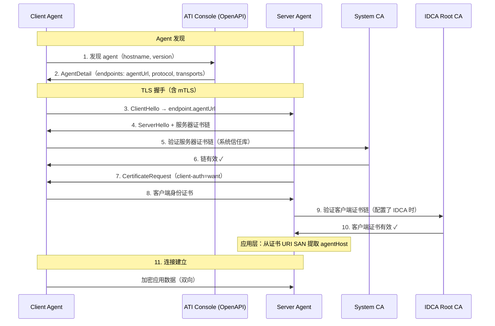
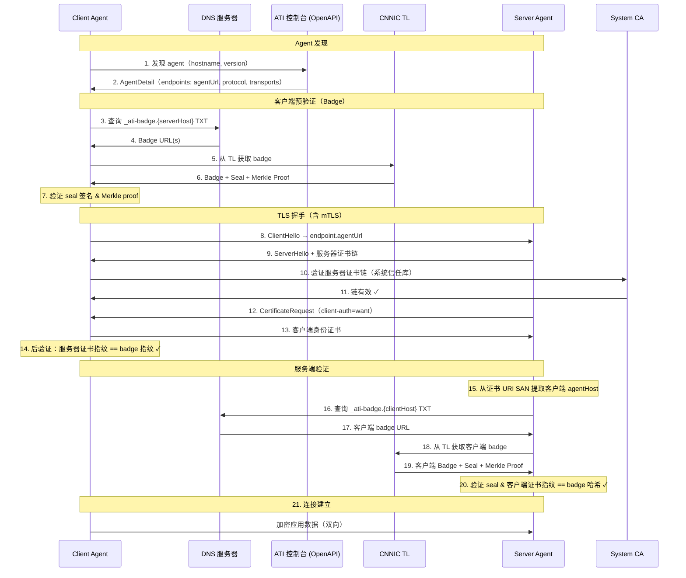
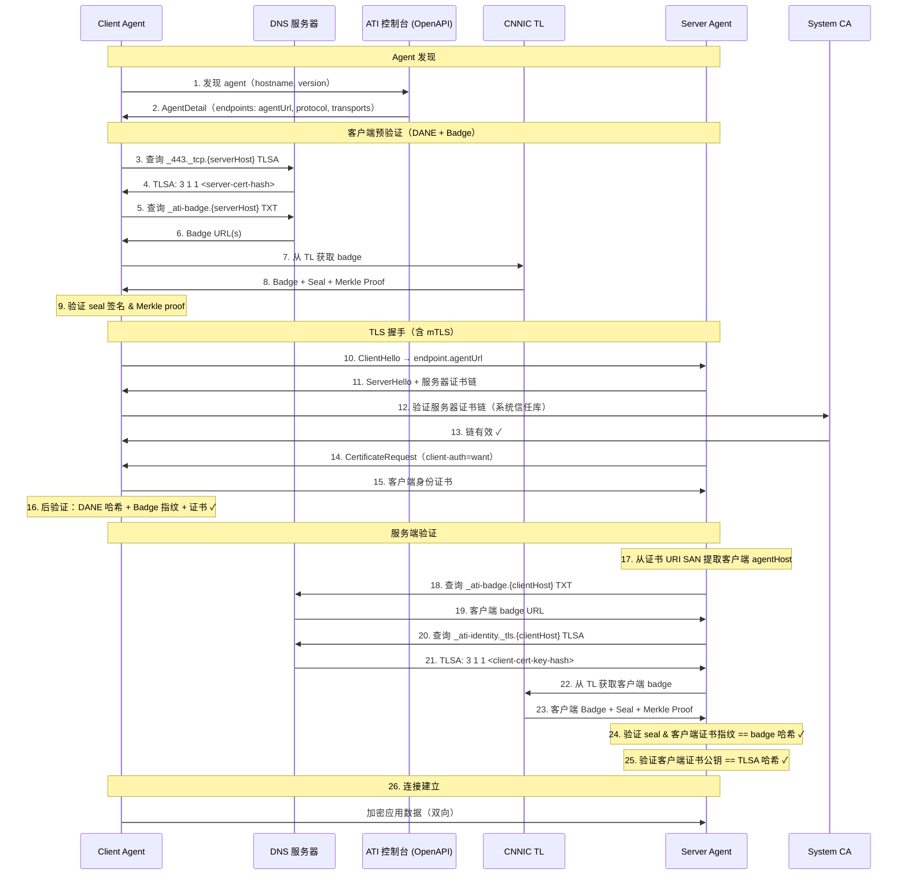

# ATI Java SDK

> Agent 信任基础设施 (ATI) Java SDK — 通过 DNS 发现、DANE TLSA 验证和透明日志认证，实现安全的 Agent 间通信。

[English](README.md) | [中文](README.zh-CN.md)

## 特性

- **基于 DNS 的 Agent 发现** — 通过 ATI Name（`ati://v{version}.{agentHost}`）解析 Agent
- **DANE TLSA 验证** — 通过 DNS TLSA 记录验证服务器证书
- **Badge 验证** — 通过透明日志加密验证 Agent 注册信息
- **mTLS 安全连接** — 支持身份证书的双向 TLS
- **SCITT 透明性头** — 签名的透明性头，用于可审计的 Agent 交互
- **Spring Boot 自动配置** — 通过 `ati.sdk.*` 属性实现零配置集成

## 验证策略

| 策略 | TLS | DANE | Badge | 说明 |
|------|-----|------|-------|------|
| `PKI_ONLY` | ✓ | - | - | 仅标准 TLS |
| `BADGE_REQUIRED` | ✓ | - | ✓ | TLS + Badge 验证（默认） |
| `DANE_AND_BADGE` | ✓ | ✓ | ✓ | TLS + DANE + Badge |

## 验证时序图

### PKI_ONLY：Agent 发现 + 标准 TLS（+ 服务端 IDCA 验证）



### BADGE_REQUIRED：TLS + 透明日志验证



### DANE_AND_BADGE：完整验证



## 模块

| 模块 | 说明 |
|------|------|
| [`ati-sdk-core`](ati-sdk-core/README.md) | 配置、认证、HTTP、工具类 |
| [`ati-sdk-discovery`](ati-sdk-discovery/README.md) | 基于 DNS 的 Agent 解析 |
| [`ati-sdk-transparency`](ati-sdk-transparency/README.md) | 透明日志 + SCITT 验证 |
| [`ati-sdk-agent-client`](ati-sdk-agent-client/README.md) | 安全的 Agent 间连接 |
| [`ati-sdk-spring-boot-starter`](ati-sdk-spring-boot-starter/README.md) | Spring Boot 自动配置 |

## 安装

### Gradle

```kotlin
// Spring Boot（推荐，包含所有模块）
implementation("com.aliyun.ati:ati-sdk-spring-boot-starter:0.1.0")

// 或按需引入单个模块
implementation("com.aliyun.ati:ati-sdk-agent-client:0.1.0")     // 客户端连接
implementation("com.aliyun.ati:ati-sdk-discovery:0.1.0")         // Agent 发现
implementation("com.aliyun.ati:ati-sdk-transparency:0.1.0")      // 透明日志
```

### Maven

```xml
<dependency>
  <groupId>com.aliyun.ati</groupId>
  <artifactId>ati-sdk-spring-boot-starter</artifactId>
  <version>0.1.0</version>
</dependency>
```

## 快速开始

### Agent 注册

Agent 注册在[阿里云 ATI 控制台](https://dnsnext.console.aliyun.com/ati/agents)完成。注册流程：

```
┌──────────────┐    ┌──────────────┐    ┌──────────────┐    ┌──────────────┐
│   Generate   │───▶│    Submit    │───▶│  ACME + DNS  │───▶│    ACTIVE    │
│ Identity CSR │    │  to Console  │    │ Verification │    │(Discoverable)│
└──────────────┘    └──────────────┘    └──────────────┘    └──────────────┘
```

1. **生成身份密钥对** — 线下为身份证书创建 RSA/EC 密钥对
2. **生成身份 CSR** — 创建包含 ATI Name URI SAN 的证书签名请求
3. **提交注册** — 在 ATI 控制台输入服务证书 + 身份 CSR，并注册 agentHost、version、endpoints（服务证书由用户提供）
4. **ACME 验证** — 添加 DNS TXT 记录证明域名所有权
5. **身份证书签发** — ATI 签发身份证书（服务证书由用户提供，非 ATI 签发）
6. **DNS 验证** — 添加 TLSA 和 badge DNS 记录
7. **激活** — Agent 可通过 ATI Name 发现

> **注意：** 所有步骤均在 ATI 控制台完成，注册过程不需要 SDK 代码。

### Agent 发现

通过阿里云 OpenAPI 解析 Agent 信息：

```java
import com.aliyun.ati.sdk.discovery.DnsAtiDiscoveryClient;
import com.aliyun.ati.sdk.auth.AccessKeyCredentialsProvider;
import com.aliyun.ati.sdk.discovery.AtiAgentDescriptor;

// 使用 AK/SK 创建发现客户端
DnsAtiDiscoveryClient client = DnsAtiDiscoveryClient.builder()
    .endpoint("alidns.aliyuncs.com")
    .credentialsProvider(new AccessKeyCredentialsProvider(ak, sk))
    .build();

// 按 hostname 和版本约束解析
AtiAgentDescriptor agent = client.discover("agent.example.com", "1.0.0");
System.out.println("Agent host: " + agent.getAgentHost());
System.out.println("Badge URL: " + agent.getBadgeUrl());

// 解析最新版本
AtiAgentDescriptor latest = client.discover("agent.example.com");

// 异步解析
CompletableFuture<AtiAgentDescriptor> future = client.discoverAsync("agent.example.com");
```

### Agent 间连接

使用可配置的验证级别连接其他 Agent：

```java
import com.aliyun.ati.sdk.agent.AtiVerifiedClient;
import com.aliyun.ati.sdk.agent.ConnectOptions;
import com.aliyun.ati.sdk.agent.VerificationPolicy;
import com.aliyun.ati.sdk.agent.AtiConnection;

// 创建客户端
AtiVerifiedClient client = AtiVerifiedClient.builder()
    .keyStorePath("/path/to/identity.p12", "password")
    .policy(VerificationPolicy.BADGE_REQUIRED)
    .build();

// 仅 PKI — 标准 HTTPS + CA 验证
AtiConnection conn = client.connect("https://agent.example.com",
    ConnectOptions.builder()
        .verificationPolicy(VerificationPolicy.PKI_ONLY)
        .build());

// Badge 验证（推荐）— 通过透明日志验证
AtiConnection conn = client.connect("https://agent.example.com",
    ConnectOptions.builder()
        .verificationPolicy(VerificationPolicy.BADGE_REQUIRED)
        .build());

// 完整验证 — DANE + Badge
AtiConnection conn = client.connect("https://agent.example.com",
    ConnectOptions.builder()
        .verificationPolicy(VerificationPolicy.DANE_AND_BADGE)
        .build());

// 使用 mTLS 客户端证书 + Bearer token
AtiConnection conn = client.connect("https://agent.example.com",
    ConnectOptions.builder()
        .verificationPolicy(VerificationPolicy.DANE_AND_BADGE)
        .clientCertPath(Path.of("/path/to/client.crt"), Path.of("/path/to/client.key"))
        .authProvider(HttpAuthHeadersProvider.bearer("token"))
        .build());
```

### Spring Boot 自动配置

`application.yml`（客户端）：

```yaml
ati:
  sdk:
    mode: client
    discovery:
      endpoint: alidns.aliyuncs.com
      access-key-id: ${ATI_AK}
      access-key-secret: ${ATI_SK}
    identity:
      certificate: /path/to/identity.crt
      private-key: /path/to/identity.key
    transparency:
      base-url: https://ati-tl.cnnic.cn:8180
    verification:
      policy: BADGE_REQUIRED
    client:
      dns-timeout: 5s
      connect-timeout: 10s
```

`application.yml`（服务端）：

```yaml
ati:
  sdk:
    mode: server
    server:
      certificate: /path/to/server.crt
      private-key: /path/to/server.key
      port: 443
      verification:
        policy: PKI_ONLY
      idca:
        trust-certificate: /path/to/idca-trust.pem
    transparency:
      base-url: https://ati-tl.cnnic.cn:8180
```

通过 `ati.sdk.mode` 控制启用哪一侧：

| 模式 | 客户端 Bean | 服务端 Bean |
|------|-----------|-----------|
| `client` | 是 | 否 |
| `server` | 否 | 是 |
| `both` | 是 | 是 |

## 配置

### 透明日志（Transparency Log）

TransparencyClient 用于连接 ATI 透明日志，验证 Agent Badge 和 Seal。根据部署环境选择对应的地址：

```java
// 生产环境默认
TransparencyClient tl = TransparencyClient.builder()
    .baseUrl(TransparencyClient.CNNIC_BASE_URL)   // https://tl.atiagent.cn:8180
    .build();

// 自定义超时和根密钥缓存 TTL
TransparencyClient tl = TransparencyClient.builder()
    .baseUrl(TransparencyClient.CNNIC_BASE_URL)
    .connectTimeout(Duration.ofSeconds(5))
    .readTimeout(Duration.ofSeconds(15))
    .rootKeyCacheTtl(Duration.ofHours(12))   // 默认: 24 小时
    .build();
```

### 验证策略

通过 `ConnectOptions` 配置验证级别：

```java
// PKI_ONLY — 仅 TLS + 系统 CA
ConnectOptions opts = ConnectOptions.builder()
    .verificationPolicy(VerificationPolicy.PKI_ONLY)
    .build();

// BADGE_REQUIRED — TLS + ATI Badge 验证（推荐）
ConnectOptions opts = ConnectOptions.builder()
    .verificationPolicy(VerificationPolicy.BADGE_REQUIRED)
    .transparencyClient(tl)
    .build();

// DANE_AND_BADGE — TLS + DANE TLSA + ATI Badge（最高级别）
ConnectOptions opts = ConnectOptions.builder()
    .verificationPolicy(VerificationPolicy.DANE_AND_BADGE)
    .transparencyClient(tl)
    .build();
```

### mTLS 客户端证书

通过 `ConnectOptions` 提供客户端证书以实现双向 TLS 认证：

```java
// 从 PEM 文件路径加载
ConnectOptions opts = ConnectOptions.builder()
    .verificationPolicy(VerificationPolicy.BADGE_REQUIRED)
    .transparencyClient(tl)
    .clientCertPath(Path.of("/path/to/client.crt"))
    .clientKeyPath(Path.of("/path/to/client.key"))
    .build();

// 或直接传入内存对象
ConnectOptions opts = ConnectOptions.builder()
    .clientCertificate(x509Cert, privateKey)
    .build();
```

对于 `AtiVerifiedClient`，使用 PKCS12 密钥库：

```java
AtiVerifiedClient client = AtiVerifiedClient.builder()
    .keyStorePath("/path/to/keystore.p12", "password")
    .transparencyClient(tl)
    .policy(VerificationPolicy.BADGE_REQUIRED)
    .build();
```

### 认证

通过 `HttpAuthHeadersProvider` 为 Agent 请求添加认证头：

```java
// Bearer Token
ConnectOptions opts = ConnectOptions.builder()
    .authProvider(HttpAuthHeadersProvider.bearer("eyJhbGciOiJSUzI1NiIs..."))
    .build();

// API Key（sso-key 格式）
ConnectOptions opts = ConnectOptions.builder()
    .authProvider(HttpAuthHeadersProvider.apiKey("my-key", "my-secret"))
    .build();

// 自定义头
ConnectOptions opts = ConnectOptions.builder()
    .authProvider(HttpAuthHeadersProvider.header("X-Custom-Auth", "value"))
    .build();

// 多个头
ConnectOptions opts = ConnectOptions.builder()
    .authProvider(HttpAuthHeadersProvider.headers(Map.of(
        "X-Api-Key", "key123",
        "X-Tenant-Id", "tenant456"
    )))
    .build();
```

### 超时与重试

```java
AtiConfiguration config = AtiConfiguration.builder()
    .environment(Environment.PROD)
    .connectTimeout(Duration.ofSeconds(5))
    .readTimeout(Duration.ofSeconds(30))
    .enableRetry(3)  // 最多重试 3 次
    .build();
```

### TLSA 端口覆盖

当通过非标准端口的代理连接时，覆盖 TLSA 查询端口以确保 DANE 验证查询正确的 DNS 记录：

```java
AtiVerifiedClient client = AtiVerifiedClient.builder()
    .keyStorePath("/path/to/keystore.p12", "password")
    .transparencyClient(tl)
    .policy(VerificationPolicy.DANE_AND_BADGE)
    .tlsaPort(443)  // 始终查询 _443._tcp.{hostname} TLSA 记录
    .build();
```

### Spring Boot

使用 `ati-sdk-spring-boot-starter` 时，通过 `application.yml` 在 `ati.sdk` 前缀下配置：

```yaml
ati:
  sdk:
    mode: client
    discovery:
      endpoint: alidns.aliyuncs.com
      access-key-id: your-ak
      access-key-secret: your-sk
    identity:
      certificate: /path/to/identity.crt
      private-key: /path/to/identity.key
    transparency:
      base-url: https://ati-tl.cnnic.cn:8180
    verification:
      policy: BADGE_REQUIRED
    client:
      dns-timeout: 5s
      connect-timeout: 10s
```

| 属性 | 说明 | 默认值 |
|------|------|--------|
| `ati.sdk.mode` | SDK 模式：`client`、`server` 或 `both` | `client` |
| `ati.sdk.discovery.endpoint` | 阿里云 OpenAPI endpoint | `alidns.aliyuncs.com` |
| `ati.sdk.transparency.base-url` | 透明日志地址 | `https://ati-tl.cnnic.cn:8180` |
| `ati.sdk.verification.policy` | 客户端验证策略 | `BADGE_REQUIRED` |
| `ati.sdk.client.dns-timeout` | DNS 查询超时 | `5s` |
| `ati.sdk.client.connect-timeout` | HTTP 连接超时 | `10s` |

## 错误处理

SDK 使用异常层次结构来表示不同类型的错误：

```java
try {
    AgentConnection conn = client.connect("https://agent.example.com", options);
    String response = conn.httpApiAt("https://agent.example.com").get("/api/data");
} catch (AtiNotFoundException e) {
    // Agent 或资源未找到（404）
    System.err.println("未找到: " + e.getResourceType() + ": " + e.getResourceId());
} catch (AtiAuthenticationException e) {
    // 认证失败（401/403）
    System.err.println("认证错误: " + e.getMessage());
} catch (AtiValidationException e) {
    // 请求验证错误（422）
    System.err.println("验证错误: " + e.getMessage());
    e.getFieldErrors().forEach((field, msg) ->
        System.err.println("  " + field + ": " + msg));
} catch (AtiConflictException e) {
    // 资源冲突（409）
    System.err.println("冲突: " + e.getMessage());
} catch (AtiServerException e) {
    // 服务器错误（5xx）
    System.err.println("服务器错误 (" + e.getStatusCode() + "): " + e.getMessage());
    System.err.println("请求 ID: " + e.getRequestId());
    if (e.isRetryable()) {
        // 延迟后重试
    }
} catch (AtiException e) {
    // 其他 SDK 错误（验证失败、TLS 错误等）
    System.err.println("错误: " + e.getMessage());
}
```

| 异常 | HTTP 状态码 | 说明 |
|------|-------------|------|
| `AtiException` | — | 所有 SDK 错误的基类 |
| `AtiNotFoundException` | 404 | Agent 或资源未找到 |
| `AtiAuthenticationException` | 401/403 | 凭证无效或已过期 |
| `AtiValidationException` | 422 | 请求验证失败（包含字段级错误） |
| `AtiConflictException` | 409 | 资源已存在或操作冲突 |
| `AtiServerException` | 5xx | 服务器端错误（可重试） |

所有异常均继承 `AtiException`，可能携带 `requestId` 用于技术支持：

```java
} catch (AtiException e) {
    String requestId = e.getRequestId();  // 客户端错误时可能为 null
}
```

## 构建

```bash
./gradlew clean build
```

环境要求：Java 17+、Gradle 8.5+

## 版本约束

发现 Agent 时，可以指定版本约束来选择特定的 Agent 版本：

| 约束 | 匹配 |
|------|------|
| `1.2.3` | 精确版本 1.2.3 |
| `^1.2.0` | 兼容 1.2.0（>=1.2.0 <2.0.0）|
| `~1.2.0` | 近似 1.2.0（>=1.2.0 <1.3.0）|
| `*` | 任意版本（最新）|

```java
AtiDiscoveryClient client = new AtiDiscoveryClient(
    "alidns.aliyuncs.com", accessKeyId, accessKeySecret);

// 精确版本
AgentDetail agent = client.discover("agent.example.com", "1.0.0");

// 任意 1.x 版本
AgentDetail agent = client.discover("agent.example.com", "^1.0.0");

// 任意 1.2.x 版本
AgentDetail agent = client.discover("agent.example.com", "~1.2.0");

// 最新版本（省略版本参数）
AgentDetail latest = client.discover("agent.example.com");
```

版本约束由 ATI 注册表服务端解析。`agentVersion` 参数直接传递给 `DescribeAtiAgentRegisterInfoMarket` API。

## 开源协议

[MIT](LICENSE)

## 贡献

参见 [CONTRIBUTING.md](CONTRIBUTING.md)
